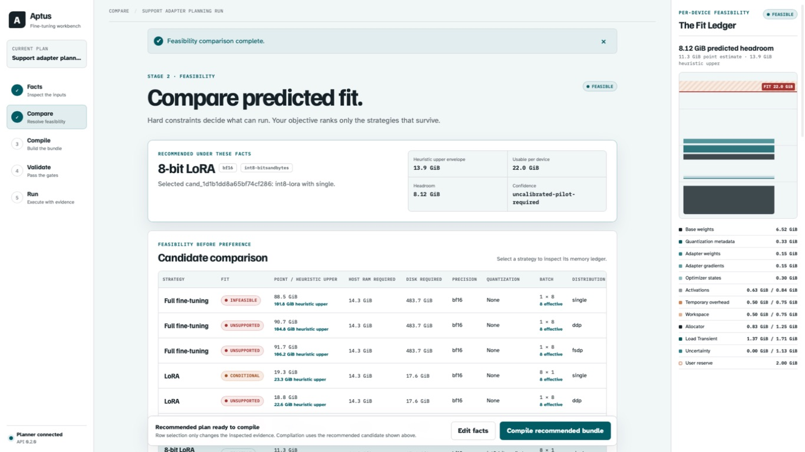

<p align="center">
  
</p>

<h1 align="center">Aptus</h1>

<p align="center"><strong>Decide whether a fine-tune will actually run — before you spend the compute.</strong></p>

<p align="center">
  Aptus turns explicit model, dataset, hardware, and runtime facts into a ranked plan,<br>
  a runtime-bound bundle, and an evidence ladder that refuses unsupported claims.
</p>

<p align="center">
  <a href="https://github.com/ogprotege/Aptus/actions/workflows/ci.yml"></a>
  <a href="https://github.com/ogprotege/Aptus/actions/workflows/desktop-artifacts.yml"></a>
  
  
  
</p>

<p align="center">
  <a href="#quick-start"><strong>Quick start</strong></a> ·
  <a href="#see-it-work">See it work</a> ·
  <a href="#what-is-supported">What is supported</a> ·
  <a href="docs/index.md">Documentation</a>
</p>

> **Status:** Engineering preview · **Applies to:** Aptus 0.2 · **Last reviewed:** 2026-07-29 · **Review by:** 2026-10-27 or when the support contract changes

---

<p align="center">
  
</p>

<p align="center"><sub>The Compare stage. Every candidate keeps its status and reason — infeasible and unsupported rows stay visible.</sub></p>

---

## Contents

- [The problem](#the-problem)
- [Quick start](#quick-start)
- [See it work](#see-it-work)
- [The five-stage workflow](#the-five-stage-workflow)
- [Command reference](#command-reference)
- [What runs where](#what-runs-where)
- [What is supported](#what-is-supported)
- [Recorded evidence](#recorded-evidence)
- [How Aptus fails closed](#how-aptus-fails-closed)
- [Architecture at a glance](#architecture-at-a-glance)
- [Requirements](#requirements)
- [Data safety](#data-safety)
- [Documentation](#documentation)
- [Contributing](#contributing)
- [Project status](#project-status)

---

## The problem

Deciding how to fine-tune a model usually means guessing. You pick a method from
a blog post, start a run, and find out hours later that it does not fit, that the
quantization path was never supported on your hardware, or that the checkpoint
you exported cannot be reloaded.

Aptus makes that decision explicit and auditable *before* the compute is spent.

| You provide | Aptus evaluates | You receive |
| --- | --- | --- |
| A pinned model, supervised dataset, target hardware, and training goal | Which supported methods appear feasible, which fail, and why | A decision record and a no-clobber training bundle with code, configuration, evidence, and hashes |

It compares Full, LoRA, int8-LoRA, and QLoRA across the placements it can
represent, and it preserves infeasible and unsupported candidates instead of
hiding them. A recommendation means *highest-ranked within this bounded Aptus
catalog*. It is not a quality prediction, and it is not a guarantee that
unmeasured hardware will fit.

**Aptus is for you if** you run fine-tuning on your own hardware, need to justify
why a configuration was chosen, or have been burned by a run that failed three
hours in. **It is not** a training framework, a hosted service, a
hyperparameter search, or a model-quality benchmark.

---

## Quick start

### Plan without a GPU

Planning is pure arithmetic over declared facts, so it runs anywhere.

```bash
git clone https://github.com/ogprotege/Aptus.git
cd Aptus
python -m venv .venv && source .venv/bin/activate
python -m pip install -e '.[server,test]'

aptus profile --dataset ./examples/support-sft.jsonl
```

Then produce a full ranked plan — see [See it work](#see-it-work) for the exact
command and its real output.

### Build the Mac app

```bash
desktop/macos/build.sh
open desktop/macos/dist/Aptus.app
```

The build runs the Python, React, and native test gates before producing
`Aptus.app`, `Aptus.app.zip`, `Aptus-macOS-arm64.dmg`, `SHA256SUMS`, and a
`COMMIT` marker under `desktop/macos/dist/`. The default build is ad-hoc signed;
public distribution still requires a Developer ID identity and notarization.

Every pull request and push to `main` also runs this native build on GitHub's
arm64 macOS 26 runner and uploads the same artifacts.

### Use the browser workbench

```bash
aptus serve --host 127.0.0.1 --port 8787
```

`aptus serve` mints a fresh session token per launch and prints a handoff URL.

---

## See it work

This repository ships a four-row synthetic support dataset. The command below is
real, and so is its output — declared 7B model facts against one 24 GiB CUDA
device, ranked under the quality objective.

```bash
aptus spec-plan \
  --model-id meta-llama/Llama-2-7b-hf \
  --revision 01c7f73d771dfac7d292323805ebc428287df4f9 \
  --family llama --parameters-b 7 \
  --hidden-size 4096 --intermediate-size 11008 --layers 32 --context-length 4096 \
  --license meta-llama-2 --confirm-training-allowed \
  --dataset ./examples/support-sft.jsonl \
  --backend cuda --gpu-count 1 --vram-gib 24 --free-vram-gib 22 \
  --bf16 --four-bit --eight-bit \
  --host-ram-gib 64 --host-ram-free-gib 48 --reserve-gib 2 --disk-free-gib 200 \
  --objective quality --sequence-length 128 --effective-batch-size 8 --epochs 1 \
  --output ./aptus-work/plan.json
```

Twelve candidates are enumerated — four methods across three placements — and
every one keeps its verdict:

| Method | Placement | Status | Heuristic upper |
| --- | --- | --- | ---: |
| Full | single | **infeasible** | 101.81 GiB |
| Full | ddp / fsdp | unsupported | 104.77 / 106.24 GiB |
| LoRA | single | **conditional** | 23.35 GiB |
| LoRA | ddp / fsdp | unsupported | 22.60 GiB |
| int8-LoRA | single | **feasible — recommended** | 13.88 GiB |
| int8-LoRA | ddp / fsdp | unsupported | 13.12 GiB |
| QLoRA | single | **feasible** | 8.57 GiB |
| QLoRA | ddp / fsdp | unsupported | 7.82 GiB |

Against 22.0 GiB usable device memory, full fine-tuning is rejected outright,
LoRA is conditional because its envelope exceeds what is usable, and int8-LoRA
wins under the quality objective while QLoRA remains the lower-memory
alternative. The plan is written as `aptus.training-plan.v3` with formula
`aptus-memory-v2` and a content-addressed `plan_id`.

The dataset profile and the planning decision are real. The model and hardware
facts are declared examples. Target-host model loading, measurement, and pilot
gates can still reject this plan — which is the point.

---

## The five-stage workflow

| Stage | What happens |
| --- | --- |
| **Facts** | Profile local data and record the exact model, hardware, and training target. |
| **Compare** | Apply hard feasibility rules, inspect memory ledgers, and explain the ranking. |
| **Compile** | Write a new bundle directory and deterministic ZIP without overwriting prior work. |
| **Validate** | Check contracts, identities, generated source, paths, hashes, and direct dependency pins. |
| **Run / handoff** | Run the local Apple gates, or transfer a CUDA bundle to its intended host. |

The native Mac window presents one product surface. Its sidebar owns Home,
Workbench, Machine, and Models, while the React workbench stays inline and owns
the single Facts → Compare → Compile → Validate → Run workflow. Named projects
keep immutable revisions for plans, bundles, validation, and jobs. Recovering an
old revision creates a *new* revision and never restores training authorization.

---

## Command reference

| Command | Purpose |
| --- | --- |
| `aptus profile` | Profile a local training dataset. |
| `aptus spec-plan` | Write a persisted v3 plan JSON without compiling. |
| `aptus plan` | Compatibility flow: plan, compile, validate, and archive. |
| `aptus build` | Plan, compile, validate, and archive. |
| `aptus compile` | Compile a persisted plan JSON into a portable bundle. |
| `aptus validate` | Validate a bundle at one explicit evidence level. |
| `aptus run` | Start one ordered dependency, model-data, preflight, pilot, or training job. |
| `aptus jobs` | List or inspect persisted local jobs. |
| `aptus doctor` | Inspect local training-runtime readiness without changing it. |
| `aptus diagnostics` | Create a privacy-bounded support archive. |
| `aptus serve` | Serve the local API and built React app from one origin. |
| `aptus hardware` | Inspect local CUDA hardware or fail-closed Apple Silicon inventory. |
| `aptus inspect` | Inspect local hardware or bounded provider model facts. |

`python -m aptus` is equivalent to `aptus`. Full flags are in the
[CLI reference](docs/reference/cli.md).

---

## What runs where

| Native Mac product | MLX-LM runtime on Apple Silicon | CUDA runtime |
| --- | --- | --- |
| Inspect the machine, models, data, plans, and runs | Verify exact MLX and MLX-LM versions | Verify Torch, Transformers, PEFT, and CUDA |
| Profile data and inspect pinned model facts | Load the pinned revision and tokenize all bound rows | Load the pinned revision and tokenizer |
| Compare runtime-specific estimates | Run a bounded adapter smoke with MLX memory telemetry | Run synthetic preflight, two-phase pilot, and admitted training |
| Compile, validate, and reveal artifacts | Run an uninterrupted pilot, reload its adapter in a fresh process, then admit confirmed full-duration training | Produce and verify the selected export |

Choose the exact Python interpreter in the Mac **Models** screen. Its environment
doctor shows every likely interpreter, its Python version, import result, and
exact pin-compatibility result. Aptus installs nothing. Only an interpreter
matching the reviewed MLX pins can be selected or reported ready. CUDA profiles
describe a CUDA host; they do not enable CUDA work on the Mac.

---

## What is supported

| Area | Supported now | Not supported |
| --- | --- | --- |
| **Methods** | Full, LoRA, int8-LoRA, QLoRA | DoRA, BitFit, AdaLoRA, ShareLoRA, LoReFT and other research identities |
| **CUDA** | Single-device and DDP; conditional LoRA FSDP | Full-parameter FSDP, quantized FSDP, ROCm, CPU training |
| **Apple Silicon** | Conditional MLX-LM LoRA and QLoRA, single device only | Full-parameter or DoRA through MLX-LM, PyTorch MPS compilation, CUDA execution on macOS |
| **MoE** | Exact `qwen3_moe` / `Qwen3MoeForCausalLM` on the reviewed four-bit layout, single-device MLX-LM QLoRA with attention-only adapters | All other MoE families, shared-expert variants, MoE on CUDA, distributed MoE, other MoE methods |
| **Data** | JSON, JSONL, CSV and text with common SFT row shapes | Sequence packing; tasks other than SFT. Whole-text rows do not compile for `mlx-lm` |
| **Recovery** | Named projects with immutable content-hashed revisions | Crash resume for MLX-LM or CUDA full runs |
| **Distribution** | Source build and ad-hoc-signed CI artifacts | A notarized public download |

Aptus also provides runtime-bound plans with separate compute, compiler,
estimator, evidence, and export identities; Apple platform discovery for chip,
CPU count, unified memory, headroom, pressure, swap, and Metal working-set
guidance; local LM Studio and oMLX adapters for inference and evaluation
(neither is a training engine); typed API responses under `aptus.api.v1` with a
checked OpenAPI artifact; and read-only diagnosis via `aptus doctor`.

Read the [complete capability matrix](docs/reference/capability-matrix.md)
before committing compute time.

---

## Recorded evidence

| Exact recorded gate | Observed result |
| --- | ---: |
| MLX-LM five-action workflow | 18.65 s and 17.47 s, 18.06 s mean |
| Confirmed full train, export, and fresh reload | 4.73 s and 5.06 s |
| Highest full-run MLX peak | 555.1 MiB |
| Qwen3 30B MoE live admission | 47.759 GiB required, 28.827 GiB available, **18.932 GiB shortfall** |
| Real MLX synthetic MoE forward | 0.877 ms median, small unquantized two-layer probe |
| Ten clean desktop builds at `1038ecdd` | 58.1 s mean, 55–63 s range |

These are acceptance telemetry for one recorded M5 Pro host, a 0.5B four-bit
model, and a four-row synthetic dataset. They are **not** production throughput,
scalability, or model-quality measurements. The synthetic MoE forward is not
autoregressive generation and does not project 30B speed. The 30B checkpoint
never loaded, so no 30B throughput claim exists.

Full records: [MLX-LM acceptance](docs/operations/evidence/2026-07-27-mlx-lm-acceptance/README.md) ·
[Desktop stability](docs/operations/evidence/2026-07-27-desktop-release/README.md) ·
[Qwen3 MoE admission](docs/operations/evidence/2026-07-28-qwen3-moe-admission/README.md)

---

## How Aptus fails closed

- Unsupported combinations remain visible with their rejection reasons.
- Estimates never become measured facts merely because they rank first.
- Every compiled artifact binds back to its plan, candidate, data, and evidence.
- Pilot and train admission repeat their checks against the *current*
  environment and available capacity, not the values seen at plan time.
- Compilation refuses a non-empty output directory and never overwrites a run.

The Qwen3 MoE row in the evidence table above is this stance working: the gate
measured live memory, refused before loading a single weight, reported the exact
shortfall, and recorded the refusal rather than degrading silently.

---

## Architecture at a glance

Four execution surfaces:

| Surface | Path | Responsibility |
| --- | --- | --- |
| Python application | `src/aptus/` | Planner, compiler, validator, job service, FastAPI API, CLI |
| React workbench | `web/src/` | The Facts → Compare → Compile → Validate → Run workflow |
| Native macOS host | `desktop/macos/` | AppKit/SwiftUI shell embedding the workbench over a private loopback backend |
| Generated bundle programs | `src/aptus/_bundle_programs/` | Self-contained `train.py` / `run.py` / `preflight.py` / `validate.py` emitted into every bundle |

Bundles must run **without importing the Aptus package**. Core dependency
direction runs `domain.py` → registry, profiling, inspection → `planning.py` →
`plan_contract.py` → `generation.py` → `validation.py` → `execution.py` →
API and CLI. The [code map](docs/architecture/code-map.md) has the full
module-responsibility table.

---

## Requirements

| | Minimum |
| --- | --- |
| Python | 3.11 or 3.12 |
| Planning only | Any platform; no accelerator required |
| Apple Silicon training | macOS 15 floor, macOS 26 primary; `mlx==0.31.2`, `mlx-lm==0.31.3` |
| CUDA training | A CUDA host with the matching driver; Torch, Transformers, PEFT |
| Mac app build | Xcode 26, XcodeGen, Node.js, `uv`, and Python 3.12 available to `uv` |

See [installation details](docs/getting-started/install.md) for prerequisites,
signing options, persistent paths, and the browser-based development path.

---

## Data safety

Compiled bundles and ZIPs contain **cleartext copies of your training data**.
Runtime artifacts can add model caches, logs, CUDA checkpoints, MLX weight
snapshots, metrics, adapters, and final weights. Treat the entire bundle as
sensitive, and read the [security policy](SECURITY.md) before using private or
governed data.

---

## Documentation

| Goal | Start here |
| --- | --- |
| Create a first plan without a GPU | [First-plan tutorial](docs/getting-started/first-plan.md) |
| Choose a method | [Method selection guide](docs/guides/choose-a-method.md) |
| Prepare real training data | [Dataset guide](docs/guides/prepare-a-dataset.md) |
| Diagnose a failure | [Troubleshooting](docs/guides/troubleshooting.md) |
| Operate an Apple or CUDA bundle | [Operator checklist](docs/operations/operator-checklist.md) |
| Understand the memory math | [Memory estimation](docs/methodology/memory-estimation.md) |
| Understand the system | [Architecture](docs/architecture/system.md) |
| Integrate | [CLI](docs/reference/cli.md) and [API](docs/reference/api.md) |
| Know exactly what is supported | [Capability matrix](docs/reference/capability-matrix.md) |

The complete hub is [docs/index.md](docs/index.md).

---

## Contributing

```bash
python -m venv .venv && source .venv/bin/activate
python -m pip install -e '.[server,test]'
cd web && npm ci
```

Before opening a pull request:

```bash
.venv/bin/ruff format --check src/aptus tests/aptus
.venv/bin/ruff check src tests tools
PYTHONPATH=src:. python -m unittest discover -s tests -t .
.venv/bin/python tools/generate_openapi.py --check
.venv/bin/python tools/check_client_contracts.py
.venv/bin/python tools/verify_versions.py
cd web && npm run openapi:check && npm test && npm run typecheck && npm run build
```

Documentation must be updated in the same change as behavior. Read
[CONTRIBUTING.md](CONTRIBUTING.md) and the
[contract-change guide](docs/contributing/changing-contracts.md) first.

---

## Project status

<details>
<summary>Engineering preview — what is and is not proven</summary>

**Status:** Engineering preview | **Applies to:** Aptus 0.2<br>
**Last reviewed:** 2026-07-29 | **Review by:** 2026-10-27 or when the support contract changes

Aptus has separate CUDA and MLX-LM compiler contracts. Apple Silicon LoRA and
QLoRA candidates remain conditional until their exact bundle passes measured
gates. Two clean, independent Apple Silicon workflows reached
`measured-run-pass` against a revision-pinned public model. Crash resume remains
unsupported.

Ten consecutive clean local desktop engineering builds passed at implementation
commit `1038ecdd13103418ef1135e1ced634c10370a961`. That record is historical
evidence for that exact commit. Pull-request CI rebuilds and packages GitHub's
exact tested merge commit and records it in `COMMIT`. The default Mac build is
ad-hoc signed; public distribution still requires a Developer ID identity and
notarization. **No real CUDA target-host pilot has completed the release gates.**

The first MoE compatibility slice is exact and fail-closed. It recognizes
`qwen3_moe` checkpoints with `Qwen3MoeForCausalLM` only when they use the
reviewed MLX layout — four-bit group-64 defaults plus one eight-bit group-64
`model.layers.N.mlp.gate` override per layer — and then permits only
single-device MLX-LM QLoRA with attention-only adapters. That slice still
requires full real-model acceptance. Its first exact 30B attempt passed
dependency validation, then refused model loading with an 18.932 GiB live
unified-memory shortfall. See the
[Qwen3 MoE admission record](docs/operations/evidence/2026-07-28-qwen3-moe-admission/README.md).

The [roadmap](ROADMAP.md) tracks remaining release work.

</details>

---

## Funding

<a href="https://www.buymeacoffee.com/thebiscuit" target="_blank"></a>

## License

MIT. See [LICENSE](LICENSE).
