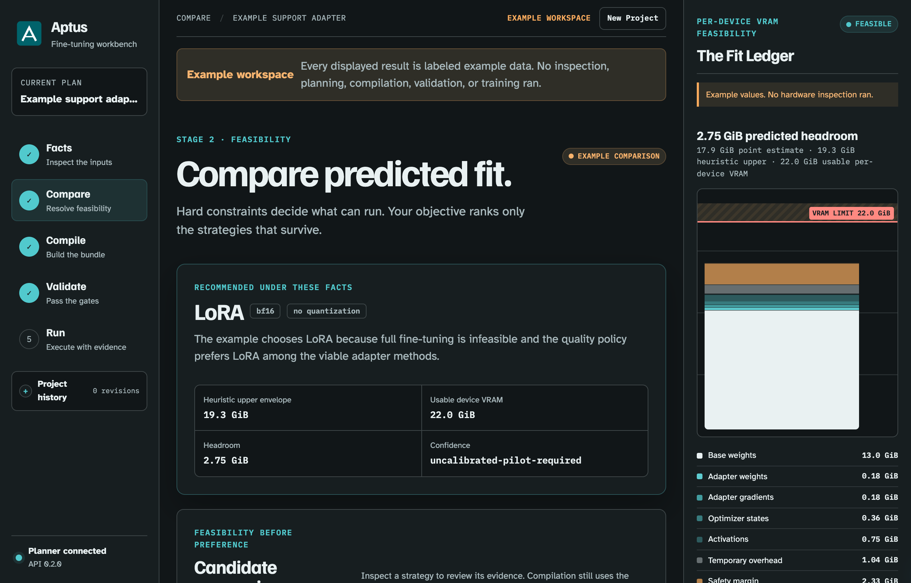
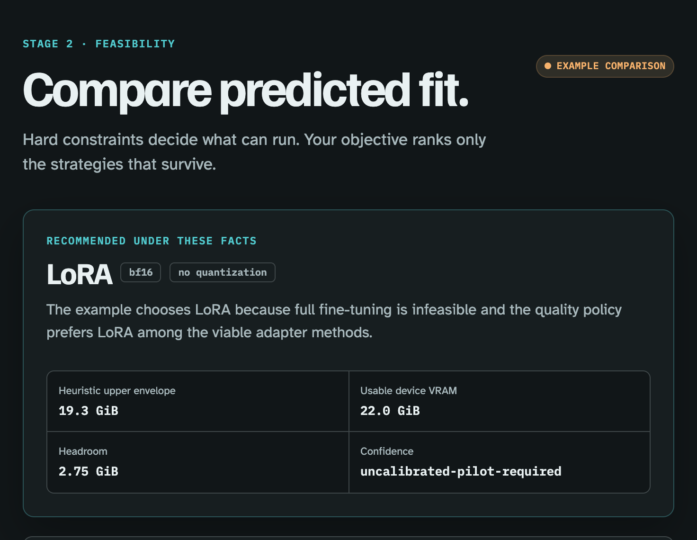

<p align="center">
  
</p>

<h1 align="center">Aptus</h1>

<p align="center"><strong>Decide whether a fine-tune will actually run — before you spend the compute.</strong></p>

<p align="center">
  Aptus turns explicit model, dataset, hardware, and runtime facts into a ranked plan,<br>
  a runtime-bound bundle, and an evidence ladder that refuses unsupported claims.
</p>

<p align="center">
  <a href="https://github.com/ogprotege/Aptus/actions/workflows/ci.yml"></a>
  <a href="https://github.com/ogprotege/Aptus/actions/workflows/desktop-artifacts.yml"></a>
  
  
  
</p>

<p align="center">
  <a href="#quick-start"><strong>Quick start</strong></a> ·
  <a href="#see-it-work">See it work</a> ·
  <a href="#what-is-supported">What is supported</a> ·
  <a href="docs/index.md">Documentation</a>
</p>

> **Status:** Engineering preview · **Applies to:** Aptus 0.2 · **Last reviewed:** 2026-08-13 · **Review by:** 2026-11-01 or when the support contract changes

---

<p align="center">
  
</p>

<p align="center"><sub>Dark appearance at Retina resolution. Aptus is connected to its local API. The displayed plan is labeled interface example data, so no inspection, planning, compilation, validation, or training ran.</sub></p>

---

## Contents

- [The problem](#the-problem)
- [Quick start](#quick-start)
- [See it work](#see-it-work)
- [The five-stage workflow](#the-five-stage-workflow)
- [Command reference](#command-reference)
- [What runs where](#what-runs-where)
- [What is supported](#what-is-supported)
- [Recorded evidence](#recorded-evidence)
- [How Aptus fails closed](#how-aptus-fails-closed)
- [Architecture at a glance](#architecture-at-a-glance)
- [Requirements](#requirements)
- [Data safety](#data-safety)
- [Documentation](#documentation)
- [Contributing](#contributing)
- [Project status](#project-status)

---

## The problem

Deciding how to fine-tune a model usually means guessing. You pick a method from
a blog post, start a run, and find out hours later that it does not fit, that the
quantization path was never supported on your hardware, or that the checkpoint
you exported cannot be reloaded.

Aptus makes that decision explicit and auditable *before* the compute is spent.

| You provide | Aptus evaluates | You receive |
| --- | --- | --- |
| A pinned model, supervised dataset, target hardware, and training goal | Which supported methods appear feasible, which fail, and why | A decision record and a no-clobber training bundle with code, configuration, evidence, and hashes |

It compares Full, LoRA, int8-LoRA, and QLoRA across the placements it can
represent, and it preserves infeasible and unsupported candidates instead of
hiding them. A recommendation means *highest-ranked within this bounded Aptus
catalog*. It is not a quality prediction, and it is not a guarantee that
unmeasured hardware will fit.

**Aptus is for you if** you run fine-tuning on your own hardware, need to justify
why a configuration was chosen, or have been burned by a run that failed three
hours in. **It is not** a training framework, a hosted service, a
hyperparameter search, or a model-quality benchmark.

---

## Quick start

### Plan without a GPU

Planning is pure arithmetic over declared facts, so it runs anywhere.

```bash
git clone https://github.com/ogprotege/Aptus.git
cd Aptus
python -m venv .venv && source .venv/bin/activate
python -m pip install -e '.[server,test]'

aptus profile --dataset ./examples/support-sft.jsonl
```

Then produce a full ranked plan — see [See it work](#see-it-work) for the exact
command and its real output.

### Build the Mac app

```bash
desktop/macos/build.sh
open desktop/macos/dist/Aptus.app
```

The build runs the Python, React, and native test gates before producing
`Aptus.app`, `Aptus.app.zip`, `Aptus-macOS-arm64.dmg`, `SHA256SUMS`, and a
`COMMIT` marker under `desktop/macos/dist/`. The default build is ad-hoc signed;
public distribution still requires a Developer ID identity and notarization.

Every pull request and push to `main` also runs this native build on GitHub's
arm64 macOS 26 runner. The workflow repackages the app as
`Aptus-macOS-arm64.zip`, regenerates `SHA256SUMS` for that ZIP, the DMG, and
`COMMIT`, and uploads those four files as the
`aptus-macos-arm64-<commit-sha>` GitHub Actions artifact. The local
`Aptus.app.zip` name is not the CI upload name.

### Use the browser workbench

```bash
aptus serve --host 127.0.0.1 --port 8787
```

`aptus serve` mints a fresh session token per launch. It prints the workbench
origin without the token, plus the same value as an API bearer token.

---

## See it work

This repository ships a four-row synthetic support dataset. The command below is
real, and so is its output — declared 7B model facts against one 24 GiB CUDA
device, ranked under the quality objective.

```bash
aptus spec-plan \
  --model-id meta-llama/Llama-2-7b-hf \
  --revision 01c7f73d771dfac7d292323805ebc428287df4f9 \
  --family llama --parameters-b 7 \
  --hidden-size 4096 --intermediate-size 11008 --layers 32 --context-length 4096 \
  --license meta-llama-2 --confirm-training-allowed \
  --dataset ./examples/support-sft.jsonl \
  --backend cuda --gpu-count 1 --vram-gib 24 --free-vram-gib 22 \
  --bf16 --four-bit --eight-bit \
  --host-ram-gib 64 --host-ram-free-gib 48 --reserve-gib 2 --disk-free-gib 200 \
  --objective quality --sequence-length 128 --effective-batch-size 8 --epochs 1 \
  --output ./aptus-work/plan.json
```

Twelve candidates are enumerated — four methods across three placements — and
every one keeps its verdict:

| Method | Placement | Status | Heuristic upper |
| --- | --- | --- | ---: |
| Full | single | **infeasible** | 101.81 GiB |
| Full | ddp / fsdp | unsupported | 104.77 / 106.24 GiB |
| LoRA | single | **conditional** | 23.35 GiB |
| LoRA | ddp / fsdp | unsupported | 22.60 GiB |
| int8-LoRA | single | **feasible — recommended** | 13.88 GiB |
| int8-LoRA | ddp / fsdp | unsupported | 13.12 GiB |
| QLoRA | single | **feasible** | 8.57 GiB |
| QLoRA | ddp / fsdp | unsupported | 7.82 GiB |

Against 22.0 GiB usable device memory, full fine-tuning is rejected outright,
LoRA is conditional because its envelope exceeds what is usable, and int8-LoRA
wins under the quality objective while QLoRA remains the lower-memory
alternative. The plan is written as `aptus.training-plan.v6` with formula
`aptus-memory-v2`, a content-addressed `plan_id`, and the SHA-256 of the
canonical `aptus.model-policy-snapshot.v1` used to evaluate compatibility.

The dataset profile and the planning decision are real. The model and hardware
facts are declared examples. Target-host model loading, measurement, and pilot
gates can still reject this plan — which is the point.

<p align="center">
  
</p>

<p align="center"><sub>A readable crop from the labeled interface example. It demonstrates the Compare presentation and remains separate from the real CLI evidence above.</sub></p>

---

## The five-stage workflow

| Stage | What happens |
| --- | --- |
| **Facts** | Profile local data and record the exact model, hardware, and training target. |
| **Compare** | Apply hard feasibility rules, inspect memory ledgers, and explain the ranking. |
| **Compile** | Write a new bundle directory and deterministic ZIP without overwriting prior work. |
| **Validate** | Check contracts, identities, generated source, paths, hashes, and direct dependency pins. |
| **Run / handoff** | Run the local Apple gates, or transfer a CUDA bundle to its intended host. |

The native Mac window presents one product surface. Its sidebar owns Home,
Workbench, Machine, and Models, while the React workbench stays inline and owns
the single Facts → Compare → Compile → Validate → Run workflow. Named projects
keep immutable revisions for plans, bundles, validation, and jobs. Recovering an
old revision creates a *new* revision and never restores training authorization.

---

## Command reference

| Command | Purpose |
| --- | --- |
| `aptus profile` | Profile a local training dataset. |
| `aptus prepare-train` | Order JSONL so recitation rows stay in the MLX compiled-train prefix. |
| `aptus spec-plan` | Write a persisted v6 plan JSON without compiling. |
| `aptus emit-run` | Probe this host, fill omitted hardware facts, and write runnable spec-plan/ladder scripts. Does not train. |
| `aptus select-candidate` | Select one complete viable candidate into a new plan identity. |
| `aptus plan` | Compatibility flow: plan, compile, validate, and archive. |
| `aptus build` | Plan, compile, validate, and archive. |
| `aptus compile` | Compile a persisted plan JSON into a portable bundle. |
| `aptus validate` | Validate a bundle at one explicit evidence level. |
| `aptus run` | Start one ordered dependency, model-data, preflight, pilot, or training job. |
| `aptus jobs` | List or inspect persisted local jobs. |
| `aptus dispose` | Attest Use, Done, or Stop for a completed train job (not quality). |
| `aptus doctor` | Inspect local training-runtime readiness without changing it. |
| `aptus diagnostics` | Create a privacy-bounded support archive. |
| `aptus serve` | Serve the local API and built React app from one origin. |
| `aptus hardware` | Inspect local CUDA hardware or fail-closed Apple Silicon inventory. |
| `aptus inspect` | Inspect local hardware or bounded provider model facts. |
| `aptus eval-contract` | Bind a gold JSONL into an optional exact-match evaluation contract. |
| `aptus eval` | Score operator-supplied predictions against that contract. Training finished is not an eval pass. |
| `aptus eval-generate` | Run the MLX bundle `eval.py` program to write prediction-only JSONL. |

`python -m aptus` is equivalent to `aptus`. Full flags are in the
[CLI reference](docs/reference/cli.md).

---

## What runs where

| Native Mac product | MLX-LM runtime on Apple Silicon | CUDA runtime |
| --- | --- | --- |
| Inspect the machine, models, data, plans, and runs | Verify exact MLX and MLX-LM versions | Verify CUDA plus the pinned Torch, Transformers, Accelerate, safetensors, and method-specific PEFT or bitsandbytes dependencies |
| Profile data and inspect pinned model facts | Load the pinned revision and tokenize all bound rows | Load the pinned revision and tokenizer |
| Compare runtime-specific estimates | Run a bounded adapter smoke with MLX memory telemetry | Run synthetic preflight, two-phase pilot, and admitted training |
| Compile, validate, and reveal artifacts | Run an uninterrupted pilot, reload its adapter in a fresh process, then admit confirmed full-duration training | Produce and verify the selected export |

Choose the exact Python interpreter in the Mac **Models** screen. Its environment
doctor shows every likely interpreter, its Python version, import result, and
exact pin-compatibility result. Aptus installs nothing. Only an interpreter
matching the reviewed MLX pins can be selected or reported ready. CUDA profiles
describe a CUDA host; they do not enable CUDA work on the Mac.

---

## What is supported

This table describes implemented planner, policy, and compiler coverage. A
planner-supported row is not automatically runtime-qualified: the exact bundle
and target host must still pass the evidence ladder. Current runtime evidence
includes two exact Qwen2.5 MLX-LM QLoRA repetitions and the completed Phase
0–10 CUDA campaign on one exact Ubuntu RTX 3050 host. Neither evidence set
transfers to another artifact, source tree, host, or runtime configuration.

| Area | Implemented planner/compiler coverage | Outside current coverage |
| --- | --- | --- |
| **Methods** | The planner enumerates Full, LoRA, int8-LoRA, and QLoRA; compiler availability remains runtime- and placement-specific | DoRA, BitFit, AdaLoRA, ShareLoRA, LoReFT and other research identities |
| **CUDA** | Compiler paths for single-device and DDP, plus conditional LoRA FSDP; the Phase 10 packet certifies six exact single-device cells, a guarded frontier, and one endurance/job-control scope on the recorded RTX 3050 host | Full-parameter FSDP, quantized FSDP, ROCm, CPU training, multi-GPU acceptance, and any claim broader than the exact certified cells |
| **Apple Silicon** | Conditional single-device MLX-LM LoRA and QLoRA compiler paths; the exact recorded Qwen2.5 QLoRA scope is runtime-qualified | Full-parameter or DoRA through MLX-LM, PyTorch MPS compilation, CUDA execution on macOS, and transferring the Qwen2.5 result to another artifact |
| **MoE** | Two conditional, pilot-required single-device MLX-LM QLoRA policy paths with attention-only adapters: exact `qwen3_moe` / `Qwen3MoeForCausalLM` on the reviewed layout, and exact `gemma4_moe` on declared Gemma 4 experts with `router.proj` overrides. The recorded Qwen3 30B attempt stopped at the memory gate. Gemma 4 26B has no measured ladder | General MoE runtime acceptance, other MoE families, shared-expert variants, MoE on CUDA, distributed MoE, and other MoE methods |
| **Dense reviewed policy** | Conditional, pilot-required 24-layer `qwen` / `qwen2` / `Qwen2ForCausalLM` configuration footprint with a uniform four-bit group-64 layout, single-device MLX-LM QLoRA, and seven attention/MLP projection targets | Other dense policy footprints and treating one matching configuration as artifact-wide runtime acceptance |
| **Data** | JSON, JSONL, CSV and text with common SFT row shapes | Sequence packing; tasks other than SFT. Whole-text rows do not compile for `mlx-lm` |
| **Recovery** | Named projects with immutable content-hashed revisions | Crash resume for MLX-LM or CUDA full runs |
| **Distribution** | Source build, ad-hoc-signed CI artifacts, and one Developer ID signed notarized arm64 DMG at `edc6cfdec48daeb17af8cae7dbb9fde0d8112a81` ([2026-08-13 packet](docs/operations/evidence/2026-08-13-desktop-public-release/README.md)) | Any other commit, Intel Macs, App Store distribution, or treating the 2026-07-27 ad-hoc 10× gate as that public identity |

Aptus also provides runtime-bound plans with separate compute, compiler,
estimator, evidence, and export identities; Apple platform discovery for chip,
CPU count, unified memory, headroom, pressure, swap, and Metal working-set
guidance; local LM Studio and oMLX adapters for inference and evaluation
(neither is a training engine); typed API responses under `aptus.api.v1` with a
checked OpenAPI artifact; and read-only diagnosis via `aptus doctor`.

Every v6 plan persists one `aptus.model-compatibility.v2` decision and binds its
canonical policy snapshot through `model_policy_snapshot_sha256` in the plan
identity. Every candidate links to that decision, while only an exact
registered path receives an `aptus.model-policy-binding.v1` binding. Provider
inspection can add an `aptus.model-inspection-receipt.v1` with separate
compatibility-subject and observed-planning-facts digests. Direct facts remain
explicitly `user-attested`. Parameter count and training permission are never
promoted to provider facts. Old v4, v3, v2, and schema-less plans, plus
stale-policy or stale-snapshot v6 plans, require replanning instead of
reinterpretation.

The registry currently carries five reviewed policy subjects. The Qwen3 MoE row
binds its exact sparse topology and mixed quantization layout. The Qwen2 row,
`model.qwen2-24l.mlx-qlora`, is a reviewed dense configuration footprint rather
than an artifact allowlist: exact artifact and revision identity remain bound by
inspection receipts and runtime evidence. The Gemma 4 row, `model.gemma4.mlx.v1`,
is a dense family path: size and bitwidth come from the pinned revision. The
Gemma 4 unified row, `model.gemma4-unified.mlx.v1`, is a second exact identity
under family `gemma4`. Bound MLX-LM does not load that architecture, so the
row is unsupported by the current compiler contract, not a `no-policy-match`.
The Gemma 4 MoE row, `model.gemma4-moe.mlx.v1`, is a separate family
`gemma4_moe` for declared experts on `gemma4_text` /
`Gemma4ForConditionalGeneration`. It is conditional, pilot-required, and
does not transfer Qwen3 MoE evidence. Resident weight is not active
parameters.

The workbench consumes that server-owned policy as three separate records:
artifact match, selected candidate path, and evidence readiness. It strictly
correlates each response's required model subject with the submitted model ID and
immutable revision, then verifies source, receipt, complete candidate tuple, and
exact path binding. A provider path-matched receipt must carry provider-declared
provenance rather than inferred-only observations, and a successful
recommendation must structurally equal its listed candidate. The typed 422
no-feasible result preserves rejected candidates for comparison but is not
compilable.

Evidence readiness does not imply launch permission. A validation report applies
only when it binds the current plan ID, candidate ID, and model revision, and the
same exact tuple gates stage completion and runtime actions. The UI keeps
incomplete or complete evidence separate from the optional typed
`authorization_status`: `current` requires `authorization_current: true` and no
error, while `deferred` or `blocked` requires false plus a non-empty diagnostic.
An authorization tuple with no non-null member means not checked. The browser never
infers a status from diagnostic prose or changes the last report after a generic
training request fails. Non-current authorization is not itself a replan
instruction; Aptus uses the distinct `replan_required` lifecycle result for that
boundary.

Package-free portable validation checks the bundle's frozen snapshot for
integrity and decision parity. It has no installed host or current registry, so
it cannot determine host policy currency. Installed Aptus performs that
currency check during host static validation and again during managed
admission, pilot authorization, worker launch, and the completion verification
and promotion transaction.

Read the [complete capability matrix](docs/reference/capability-matrix.md)
before committing compute time.

---

## Recorded evidence

| Exact recorded gate | Observed result |
| --- | ---: |
| Phase 10 CUDA campaign aggregate | 149 planned, 58 started, 91 predeclared-not-started, 47 qualifying, 0 replacement runs |
| Stable exact-host CUDA cells | SmolLM2-135M LoRA and Full anchors; stable Phase 7 SmolLM2-135M LoRA, SmolLM2-135M Full, SmolLM2-360M LoRA, and Qwen3-0.6B LoRA cells |
| Phase 8 guarded frontier | 17 planned points; 16 started, 14 passed, 2 bounded pilot `CUDA_OOM`, 1 predeclared-not-started |
| Phase 9 endurance and job control | Three Qwen3-0.6B LoRA runs reached 300 optimizer updates each; all eight controlled job-service exercises passed |
| Exact CUDA LoRA single-device workflow at `c12c4d8` | One fresh five-job sequence reached `measured-run-pass` |
| CUDA pilot checkpoint continuation | Step 1 resumed and reached step 2 with the same 4,884,480-parameter LoRA census |
| CUDA full train and structural PEFT export | 3 optimizer updates, 384,180,224-byte allocated peak, 23,123,131-byte export |
| Phase 6 exact-source MLX-LM v5/v3 workflow at `71925515` | Two fresh, clean repetitions reached `measured-run-pass` |
| Current confirmed full train, export, and fresh reload | 3 optimizer updates and 4 reload-generation tokens in each repetition |
| Highest current full-run MLX peak | 582,146,010 bytes |
| Historical MLX-LM five-action workflow (v2 plan/bundle) | 18.65 s and 17.47 s, 18.06 s mean |
| Historical confirmed full train, export, and fresh reload | 4.73 s and 5.06 s |
| Historical highest full-run MLX peak | 555.1 MiB |
| Qwen3 30B MoE live admission | 47.759 GiB required, 28.827 GiB available, **18.932 GiB shortfall** |
| Real MLX synthetic MoE forward | 0.877 ms median, small unquantized two-layer probe |
| Ten clean desktop builds at `1038ecdd` | 58.1 s mean, 55–63 s range |
| Path Alpha MLX QLoRA at `f4775c01` | Two v6/v3 ladders to `measured-run-pass` for the frozen Qwen2.5 4-bit identity |
| Path Beta CUDA LoRA (M4 recorded source) | One five-job ladder to `measured-run-pass` plus structural PEFT on Ubuntu/RTX 3050 |
| Notarized arm64 Mac at `edc6cfd` | One Developer ID signed, notarized ZIP/DMG; not Aptus 0.2 product release |
| Path Beta 360M LoRA (M7-A) | One `measured-run-pass` on the same RTX 3050 host class; not a second host |
| Path Beta CUDA adapter reload (M7-C) | Fresh-process PEFT 1–4 tokens; not a CUDA parent completion gate |

These are acceptance telemetry for exact recorded host, runtime, model,
dataset, source, plan, and bundle bindings. The Phase 5 result is an exact-host
repeatability anchor, and the later stable cells and endurance record have only
their packet-defined meanings. They are **not** broad production throughput,
scalability, model-quality, cloud, or multi-GPU measurements. The
synthetic MoE forward is not autoregressive generation and does not project
30B speed. The 30B checkpoint never loaded, so no 30B throughput claim exists.

The two fresh 2026-08-05 MLX-LM runs supply current-contract Phase 6 runtime
evidence at their exact acceptance source for the recorded Qwen2.5 artifact
and immutable revision, Apple M5 Pro host, Python and MLX-LM runtime, four-row
synthetic dataset, v5 plan, v3 bundle, policy snapshot, source commit
`719255153e3fc7e38e83b5ff826d587e5e58bf80`, source tree
`be99f5664ccb580f2600471f1ae3241a294b1a7e`, and bundle fingerprint
`ca2548cf8469fb9867f1558428803b1c9f7c19f48cba754fdb602643f23d1919`.
Relative to the original Phase 6 baseline, only manifested operator
`README.md` and `runbook.md` changed; runtime programs and requirements remained
byte-identical. The fresh runs independently qualify the new fingerprint. The
policy remains a configuration footprint rather than an artifact allowlist.
This evidence does not transfer to another matching Qwen2 artifact, and it does
not establish safety, quality, performance, production throughput, CUDA
acceptance, production readiness, or release readiness. The original Phase 6
packet and July runs remain historical evidence for their exact scopes.

The 2026-08-06 CUDA record added one exact SmolLM2 LoRA single-device
`measured-run-pass` workflow at source commit
`c12c4d8db0037a2c278a2ad95a0a2cbda4387eed`. It covers dependency,
model-data, measured preflight, two-phase checkpoint-continuation pilot, full
training, structural PEFT adapter export, and parent-owned promotion on the
recorded Ubuntu/RTX 3050 runtime. Later Phase 5–9 packets add separately scoped
repeatability, method stability, scale and architecture cells, guarded-frontier
outcomes, and endurance/job-control evidence. The Phase 10 packet aggregates
and certifies those results without adding training. No result qualifies an
unlisted method, placement, device, model, dataset, source, or environment.

Full records: [Phase 10 CUDA campaign certification](docs/operations/evidence/2026-08-11-cuda-phase10-certification/README.md) ·
[Phase 9 endurance and job control](docs/operations/evidence/2026-08-11-cuda-phase9-endurance/README.md) ·
[Phase 8 guarded frontier](docs/operations/evidence/2026-08-11-cuda-phase8-guarded-frontier/README.md) ·
[Phase 7 same-family stability](docs/operations/evidence/2026-08-11-cuda-phase7-same-family-stability/README.md) ·
[Phase 7 architecture breadth](docs/operations/evidence/2026-08-11-cuda-phase7-breadth-stability/README.md) ·
[Phase 6 Full confirmatory stability](docs/operations/evidence/2026-08-10-cuda-phase6-confirmatory-stability/README.md) ·
[Phase 5 repeatability anchor](docs/operations/evidence/2026-08-10-cuda-phase5-repeatability-anchor/README.md) ·
[SmolLM2 CUDA LoRA single-device acceptance](docs/operations/evidence/2026-08-06-smollm2-cuda-lora-single-acceptance/README.md) ·
[Qwen2 MLX-LM exact-source acceptance](docs/operations/evidence/2026-08-05-qwen2-mlx-lm-exact-source-refresh/README.md) ·
[Original Phase 6 acceptance baseline](docs/operations/evidence/2026-08-05-qwen2-mlx-lm-acceptance/README.md) ·
[Historical MLX-LM acceptance](docs/operations/evidence/2026-07-27-mlx-lm-acceptance/README.md) ·
[Desktop stability](docs/operations/evidence/2026-07-27-desktop-release/README.md) ·
[Qwen3 MoE admission](docs/operations/evidence/2026-07-28-qwen3-moe-admission/README.md) ·
[Path Alpha MLX M3](docs/operations/evidence/2026-08-12-path-alpha-mlx-m3/README.md) ·
[Path Beta CUDA M4](docs/operations/evidence/2026-08-12-path-beta-cuda-lora-m4/README.md) ·
[Public Mac M6](docs/operations/evidence/2026-08-13-desktop-public-release/README.md) ·
[360M LoRA M7-A](docs/operations/evidence/2026-08-13-path-beta-360m-lora-m7a/README.md) ·
[CUDA reload M7-C](docs/operations/evidence/2026-08-13-path-beta-cuda-reload-m7c/README.md)

---

## How Aptus fails closed

- Unsupported combinations remain visible with their rejection reasons.
- Estimates never become measured facts merely because they rank first.
- Every compiled artifact binds back to its plan, candidate, data, policy
  snapshot, and evidence.
- Pilot and train admission repeat their checks against the *current*
  environment and available capacity, not the values seen at plan time.
- Compilation refuses a non-empty output directory and never overwrites a run.

The Qwen3 MoE row in the evidence table above is this stance working: the gate
measured live memory, refused before loading a single weight, reported the exact
shortfall, and recorded the refusal rather than degrading silently.

---

## Architecture at a glance

Four execution surfaces:

| Surface | Path | Responsibility |
| --- | --- | --- |
| Python application | `src/aptus/` | Planner, compiler, validator, job service, FastAPI API, CLI |
| React workbench | `web/src/` | The Facts → Compare → Compile → Validate → Run workflow |
| Native macOS host | `desktop/macos/` | AppKit/SwiftUI shell embedding the workbench over a private loopback backend |
| Generated bundle programs | `src/aptus/_bundle_programs/` plus copied shared contracts | Self-contained plan, policy-snapshot, lease, validation, preflight, training, and parent-runner code emitted into every bundle |

Bundles must run **without importing the Aptus package**. Core dependency
direction runs `domain.py` → catalog and method registry →
`model_compatibility.py` and its package-independent `policy_snapshot.py` →
inspection and `planning.py` → `plan_contract.py` → `generation.py` →
`validation.py` → `execution.py` → API and CLI. The
[code map](docs/architecture/code-map.md) has the full module-responsibility
table.

---

## Requirements

| | Minimum |
| --- | --- |
| Python | Package metadata accepts 3.11 or newer; CI currently tests 3.11 and 3.12 |
| Planning only | Any platform; no accelerator required |
| Apple Silicon training | macOS 15 floor, macOS 26 primary; `mlx==0.31.2`, `mlx-lm==0.31.3` |
| CUDA training | A CUDA host with the matching driver; pinned Torch, Transformers, Accelerate, and safetensors for every method; PEFT for adapters; bitsandbytes for int8-LoRA and QLoRA |
| Mac app build | Xcode 26, XcodeGen, Node.js, `uv`, and Python 3.12 available to `uv` |

See [installation details](docs/getting-started/install.md) for prerequisites,
signing options, persistent paths, and the browser-based development path.

---

## Data safety

Compiled bundles and ZIPs contain **cleartext copies of your training data**.
Runtime artifacts can add model caches, logs, CUDA checkpoints, MLX weight
snapshots, metrics, adapters, and final weights. Treat the entire bundle as
sensitive, and read the [security policy](SECURITY.md) before using private or
governed data.

---

## Documentation

| Goal | Start here |
| --- | --- |
| Create a first plan without a GPU | [First-plan tutorial](docs/getting-started/first-plan.md) |
| Choose a method | [Method selection guide](docs/guides/choose-a-method.md) |
| Prepare real training data | [Dataset guide](docs/guides/prepare-a-dataset.md) |
| Diagnose a failure | [Troubleshooting](docs/guides/troubleshooting.md) |
| Operate an Apple or CUDA bundle | [Operator checklist](docs/operations/operator-checklist.md) |
| Understand the memory math | [Memory estimation](docs/methodology/memory-estimation.md) |
| Understand the system | [Architecture](docs/architecture/system.md) |
| Understand portable policy identity | [Model-policy snapshot](docs/reference/model-policy-snapshot.md) |
| Integrate | [CLI](docs/reference/cli.md) and [API](docs/reference/api.md) |
| Know exactly what is supported | [Capability matrix](docs/reference/capability-matrix.md) |

The complete hub is [docs/index.md](docs/index.md).

---

## Contributing

```bash
python -m venv .venv && source .venv/bin/activate
python -m pip install -e '.[server,test]'
npm --prefix web ci
```

Before opening a pull request, run the canonical
[repository-wide quality gate](CONTRIBUTING.md#required-repository-wide-checks)
from the repository root. Documentation must be updated in the same change as
behavior. Read [CONTRIBUTING.md](CONTRIBUTING.md) and the
[contract-change guide](docs/contributing/changing-contracts.md) first.

---

## Project status

<details>
<summary>Engineering preview — what is and is not proven</summary>

**Status:** Engineering preview | **Applies to:** Aptus 0.2<br>
**Last reviewed:** 2026-08-11 | **Review by:** 2026-11-01 or when the support contract changes

Aptus has separate CUDA and MLX-LM compiler contracts. Apple Silicon LoRA and
QLoRA candidates remain conditional until their exact bundle passes measured
gates. Two fresh, clean, independent current-contract Apple Silicon workflows
reached `measured-run-pass` for the exact pinned Qwen2.5 artifact at source
commit `719255153e3fc7e38e83b5ff826d587e5e58bf80` and bundle fingerprint
`ca2548cf8469fb9867f1558428803b1c9f7c19f48cba754fdb602643f23d1919`.
Crash resume remains unsupported.

Phase 4's source and contract review is complete. Current
`aptus.training-plan.v6` plans and `aptus.bundle.v3` bundles cross-bind a
canonical `aptus.model-policy-snapshot.v1`. Package-free programs verify the
frozen snapshot's integrity and decision parity; installed Aptus separately
enforces current host-registry currency during host static validation and again
during managed admission, pilot authorization, worker launch, and the
completion verification and promotion transaction.
The [2026-08-05 exact-source acceptance
record](docs/operations/evidence/2026-08-05-qwen2-mlx-lm-exact-source-refresh/README.md)
binds the exact Qwen2.5 artifact, revision, runtime, host, dataset, policy
snapshot, v5 plan, v3 bundle, source commit and tree, and bundle fingerprint.
The [original Phase 6 packet](docs/operations/evidence/2026-08-05-qwen2-mlx-lm-acceptance/README.md)
remains the unchanged historical baseline. The CUDA evidence ladder begins with
the [2026-08-06 exact workflow](docs/operations/evidence/2026-08-06-smollm2-cuda-lora-single-acceptance/README.md)
and closes with the [Phase 10 certification](docs/operations/evidence/2026-08-11-cuda-phase10-certification/README.md).
The certified campaign has 149 planned slots, 58 starts, 91
predeclared-not-started dispositions, 47 qualifying outcomes, and no
replacement runs. Its six listed stable cells, guarded frontier, and
endurance/job-control result apply only to the recorded exact host and
configurations. They do not by themselves establish v0.2 release readiness.

Ten consecutive clean local desktop engineering builds passed at implementation
commit `1038ecdd13103418ef1135e1ced634c10370a961`. That record is historical
evidence for that exact commit. Pull-request CI rebuilds and packages GitHub's
exact tested merge commit and records it in `COMMIT`. The default Mac build is
ad-hoc signed. One Developer ID signed notarized arm64 identity is recorded
for `edc6cfdec48daeb17af8cae7dbb9fde0d8112a81` in the
[2026-08-13 public Mac packet](docs/operations/evidence/2026-08-13-desktop-public-release/README.md).
**The bounded CUDA campaign is complete through Phase 10. No
Phase 11 is defined; broader method, placement, host, semantic-export,
model-quality, and production-safety gates stay open.**

The first MoE compatibility slice is exact and fail-closed. It recognizes
`qwen3_moe` checkpoints with `Qwen3MoeForCausalLM` only when they use the
reviewed MLX layout — four-bit group-64 defaults plus one eight-bit group-64
`model.layers.N.mlp.gate` override per layer — and then permits only
single-device MLX-LM QLoRA with attention-only adapters. That slice still
requires full real-model acceptance. Its first exact 30B attempt passed
dependency validation, then refused model loading with an 18.932 GiB live
unified-memory shortfall. See the
[Qwen3 MoE admission record](docs/operations/evidence/2026-07-28-qwen3-moe-admission/README.md).
Lane 9 added a separate conditional `gemma4_moe` path for declared Gemma 4
experts with `router.proj` overrides. It has no measured ladder.

Phase 6 implemented a second registry-driven path for the reviewed 24-layer
dense Qwen2 configuration footprint. It permits only single-device MLX-LM QLoRA
with the exact uniform four-bit group-64 layout and seven declared attention/MLP
projection targets. Its current-contract runtime evidence applies only to the
exact acceptance source and Qwen2.5 fixture recorded above. The row remains
conditional and pilot-required:
a different matching artifact must complete its own model-data, measured
preflight, and pilot gates before Aptus can make an artifact-scoped runtime
claim.

The [roadmap](ROADMAP.md) tracks remaining release work.

</details>

---

## Funding

<a href="https://www.buymeacoffee.com/thebiscuit" target="_blank"></a>

## License

MIT. See [LICENSE](LICENSE).
