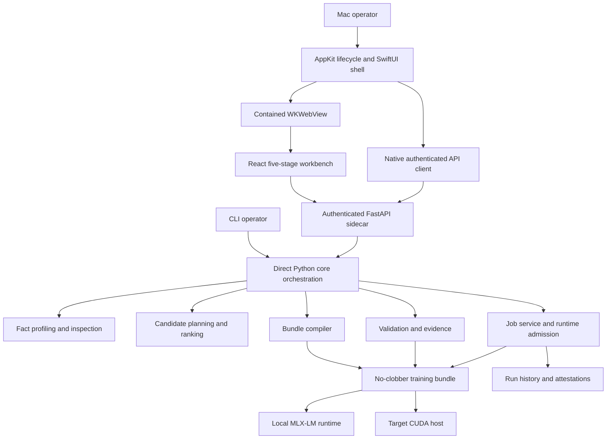

# Aptus Codebase Map

> **Status:** Superseded pre-implementation map, retained as review evidence
> **Superseded on:** 2026-07-27
> **Current map:** `docs/architecture/code-map.md`

This file records the codebase before the approved full implementation. It does
not include the unified inline workbench, immutable project revisions, typed
response contracts, diagnostic tooling, corrected shutdown containment,
packaged runtime resources, or completed MLX-LM acceptance.

**Last updated:** 2026-07-27
**Scope:** Aptus 0.2, native macOS host, React workbench, Python core, generated runtimes
**Status:** Current-state map for the product review

## Product purpose

Aptus turns pinned model, dataset, hardware, and training facts into a ranked
fine-tuning plan. It then compiles that plan into a reviewable bundle. The
bundle carries runtime code, configuration, evidence, and identity hashes.

The product's strongest contract is epistemic, not merely computational.
Aptus keeps estimates separate from measurements. It keeps unsupported options
visible. It refuses to treat a recommendation as proof of fit or quality.

The current release is an engineering preview. The repository states that no
real CUDA or Apple Silicon pilot has completed every release gate
(`README.md:25-34`). The macOS app is locally signed but not notarized.

## Runtime architecture



Python is the source of truth for facts, plans, compilation, validation, jobs,
leases, and evidence. Swift owns lifecycle, native system integration, local
session security, and the current six-destination shell. React owns the full
Facts, Compare, Compile, Validate, and Run workflow. The generated Python
programs inside each bundle form a fourth execution surface.

This separation is documented in `docs/architecture/code-map.md:5-20` and
`docs/architecture/macos-desktop.md:27-33`.

## Source ownership

### Python core

| Area | Primary source | Responsibility |
| --- | --- | --- |
| Domain contracts | `src/aptus/domain.py` | Frozen dataclasses and enums for facts, candidates, plans, reports, and run state |
| Method contract | `src/aptus/methods/` | Typed method lifecycle and selectable-method registry |
| Dataset profiling | `src/aptus/profiling.py` | Input parsing, canonical rows, statistics, and identity |
| Model inspection | `src/aptus/inspection.py` | Provider metadata, pinned revision resolution, and declared model facts |
| Hardware and inference integrations | `src/aptus/integrations.py` | Host inspection, LM Studio, oMLX, and local inference boundaries |
| Planning | `src/aptus/planning.py`, `catalog.py`, `plan_contract.py` | Candidate enumeration, memory estimates, status, ranking, and plan identity |
| Compilation | `src/aptus/generation.py` | Runtime-specific bundle source, manifests, direct pins, and deterministic ZIP output |
| Validation | `src/aptus/validation.py`, `evidence.py` | Static and measured gates, identity bindings, and evidence records |
| Execution | `src/aptus/execution.py`, `attestation.py`, `runtime_lease.py`, `runtime_env.py` | Job lifecycle, admission, subprocess control, attestations, leases, and runtime resolution |
| HTTP surface | `src/aptus/api.py` | FastAPI composition, Pydantic request models, middleware, error mapping, and all API routes |
| CLI surface | `src/aptus/cli.py` | Command-line entry points over the same application contracts |
| Desktop sidecar | `src/aptus/desktop.py` | Authenticated loopback service used by the Mac app |

### React workbench

| Area | Primary source | Responsibility |
| --- | --- | --- |
| Workflow orchestration | `web/src/App.tsx` | Connection, workflow state, transitions, polling, actions, and stage rendering |
| API contract | `web/src/api.ts`, `types.ts` | HTTP client and hand-maintained TypeScript representations |
| Facts | `web/src/stages/FactsStage.tsx` | Model, dataset, hardware, target, provenance, and readiness intake |
| Compare | `web/src/stages/CompareStage.tsx`, `components/CandidateComparison.tsx` | Ranked candidates, reasons, and resource comparison |
| Compile and validate | `web/src/stages/CompileStage.tsx`, `ValidateStage.tsx` | Output choice, artifacts, evidence levels, and findings |
| Run | `web/src/stages/RunStage.tsx`, `components/RunConsole.tsx` | Ordered runtime actions, status, logs, confirmation, and cancellation |
| Evidence signature | `web/src/components/FitLedger.tsx` | Estimated resource ledger and supporting assumptions |
| Desktop bridge | `web/src/desktopBridge.ts` | Dataset picker, output picker, Finder reveal, and workbench readiness |
| Visual system | `web/src/styles.css` | Tokens, layouts, responsive rules, focus states, and reduced motion |

### Native macOS host

| Area | Primary source | Responsibility |
| --- | --- | --- |
| Lifecycle | `AptusApplication.swift`, `MainWindowController.swift`, `StartupViewController.swift` | App launch, window ownership, startup state, and recovery |
| Sidecar process | `BackendController.swift`, `BackendProcessTree.swift` | Start, health, shutdown, restart, and process-tree handling |
| Session client | `DesktopBackendClient.swift`, `BackendModels.swift` | Exact-origin authenticated native API calls and response models |
| Platform integration | `DesktopPlatform.swift`, `ApplicationPaths.swift` | Machine facts, paths, state, sessions, logs, and runtime configuration |
| Native shell | `DesktopShell.swift` | Navigation, Home, Machine, Models, Data, Plans, Runs, and workbench sheet |
| Web host and bridge | `WebViewController.swift`, `DesktopBridge.swift` | WebKit policy, session cookie, bridge requests, file panels, and Finder actions |

## Primary data flow

1. The operator supplies or inspects exact model facts.
2. Aptus profiles a selected dataset into canonical rows and statistics.
3. Hardware facts come from a measured local scan or an explicit target-host declaration.
4. The planner enumerates the supported method and placement catalog.
5. Each candidate receives status, resource estimates, assumptions, and reasons.
6. The planner ranks viable candidates and records the bounded recommendation.
7. The compiler writes a fresh bundle and deterministic archive.
8. Validation binds the plan, bundle, model, data, environment, and hardware evidence.
9. Runtime actions proceed in order: dependencies, model-data, preflight, pilot, then confirmed training.
10. The job service records state, logs, attestations, output identity, and cancellation.

No single child process can declare its own success. Parent-side verification
checks the required output and evidence before a job becomes successful. Full
training resume remains disabled until continuity can be proven.

## Trust and storage boundaries

- The desktop sidecar binds only to `127.0.0.1` on an ephemeral port.
- The native host creates a random session token and sends it as an HttpOnly,
  SameSite Strict cookie.
- WebKit accepts only the exact session origin.
- The `aptus serve` CLI creates and prints a random session credential. A direct
  internal `create_app(session_token=None)` construction remains unauthenticated.
- App state lives under `~/Library/Application Support/Aptus/state/`.
- Backend logs live under `~/Library/Logs/Aptus/`.
- Ephemeral readiness files live under `~/Library/Caches/Aptus/sessions/`.
- Bundles and archives go only to operator-selected locations.
- Datasets, models, logs, and bundles may contain cleartext sensitive material.

See `docs/architecture/macos-desktop.md:64-92` and `SECURITY.md` for the full
boundary contract.

## External systems

- Hugging Face metadata is used for model inspection and revision pinning.
- MLX-LM is the distinct Apple Silicon training runtime.
- CUDA bundles target a separately measured CUDA host.
- LM Studio and oMLX are local inference integrations. They are not training runtimes.
- PyInstaller packages the Python desktop sidecar.
- XcodeGen and Xcode build the native arm64 application.
- Vite packages the React workbench into the Python wheel and Mac app.

## Build and verification path

The authoritative Mac gate is:

```bash
desktop/macos/build.sh
```

It performs these operations in order:

1. Run the Python suite.
2. Run the React suite, type checking, and production build.
3. Run the native Swift suite.
4. Package the Python sidecar and web assets.
5. Build the arm64 native app.
6. Sign and probe the app.
7. Produce `Aptus.app` and `Aptus-macOS-arm64.dmg`.

During this review, the gate reported 276 Python tests, 46 web tests, and 68
native tests. One first-pass native test failed intermittently during forced
process-tree shutdown. A targeted rerun and a second complete build passed.
That makes the shutdown path a reliability concern, not a deterministic build
failure.

## Distribution path

The repository can create local signed arm64 app and DMG artifacts. CI can
publish review artifacts. Public distribution still requires a Developer ID
identity, notarization, stapling, and a clean quarantine-path installation test.
The deployment floor is macOS 15. The primary development and release host is
macOS 26 (`desktop/macos/project.yml:5-6`, `README.md:76-81`).

## Structural pressure points

The implementation has sound domain boundaries but oversized composition files:

| File | Lines | Pressure |
| --- | ---: | --- |
| `src/aptus/generation.py` | 7,545 | Nine embedded executable programs plus compiler orchestration |
| `src/aptus/execution.py` | 3,170 | Verification logic plus the complete job service |
| `web/src/styles.css` | 2,969 | Global tokens, every component, stages, and responsive rules |
| `src/aptus/validation.py` | 1,748 | Multiple validation levels and runtime-specific evidence checks |
| `desktop/macos/Sources/DesktopShell.swift` | 1,131 | Shell model, six destinations, shared components, and WebView sheet |
| `src/aptus/plan_contract.py` | 1,107 | Plan identity and contract checks |
| `src/aptus/api.py` | 1,046 | App composition, security, error mapping, and every route |
| `web/src/App.tsx` | 888 | More than twenty state values, effects, actions, polling, and rendering |
| `web/src/stages/FactsStage.tsx` | 612 | Four dense expert-facing intake panels |

The current code works because tests protect many contracts. The file shapes
make small changes risky. Generated runtimes are especially hard to review,
format, type-check, and test in isolation while they remain raw string constants.

## Documentation authority

The maintained documentation correctly describes the evidence model and most
runtime boundaries. Two current records require correction:

- `docs/product/vision.md:41-42` still describes Aptus 0.2 as a local CUDA core.
  Current code and product documentation also include MLX-LM and the native Mac app.
- `SECURITY.md:32-49` says ordinary `aptus serve` has no authentication and the
  desktop sidecar rejects job submission. The CLI now creates a random session
  credential (`cli.py:564-580`), and the desktop enables execution
  (`desktop.py:94-99`). The current security boundary is broader than documented.
- `dev/active/aptus-macos/aptus-macos-code-review.md` contains stale macOS floor,
  test-count, and issue-status claims. It should remain historical or receive a
  clear supersession notice.

## Recommended documentation ownership

- Product claims: `README.md` and `docs/product/current-capabilities.md`
- Runtime support: `docs/reference/capability-matrix.md`
- Architecture boundaries: `docs/architecture/`
- Release proof: `docs/operations/release-gates.md` and dated evidence records
- Generated contract details: tests and `docs/contributing/generated-code.md`
- Current review and migration plan: `dev/active/aptus-product-review/`

Every user-facing capability claim should point to a test, a measured target-host
record, or a clearly labeled limitation. Estimates must never become release
proof through repetition in documentation.
