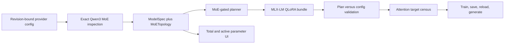

# Aptus MoE Compatibility Code and Architecture Review

**Last Updated:** 2026-07-27
**Scope:** Exact-family model inspection, plan identity, memory estimation, MLX-LM compilation, runtime validation, API, web workbench, tests, and operator documentation
**Implementation authority:** Wilson approved the full Aptus implementation and specifically prioritized executable MoE compatibility. This review is the implementation basis.

## Executive Summary

Aptus currently rejects unknown mixture-of-experts architectures correctly. That fail-closed boundary should remain. The first supported MoE contract should be exact and narrow: `Qwen3MoeForCausalLM`, provider `model_type` `qwen3_moe`, single-device Apple Silicon, four-bit MLX-LM QLoRA, and attention-projection adapters.

This path is supported by the pinned MLX-LM 0.31.3 runtime. Its built-in Qwen3 MoE implementation exposes one `self_attn.{q,k,v,o}_proj` module in every transformer layer. Expert MLPs use batched `SwitchLinear` modules. Aptus should inspect and bind that topology, but the first adapter policy should remain attention-only. This keeps the trainable set small and preserves the existing exact-one-target-per-layer proof.

Total parameters must drive base-model storage, disk, and unified-memory admission. Active parameters per token are a derived topology fact. They must not replace resident parameter count in memory calculations or imply measured throughput.

No file relocation is justified. The existing ownership boundaries are sound. The implementation should add typed topology data and shared validation helpers in their current modules.

## Critical Issues

### CRIT-1: MoE topology is not represented in the durable model contract

`ModelSpec` records dense structural facts only. The API, CLI, persisted plan, content identity, and restored web draft cannot bind expert count, experts selected per token, expert width, sparse-layer count, provider model type, or provider architecture.

**Required correction:** Add an optional immutable `MoETopology` contract and the provider architecture identifiers to `ModelSpec`. Validate all numeric relationships. Include the topology in plan and candidate identity. Keep old dense plans readable through optional defaults.

### CRIT-2: Adapter accounting assumes one dense MLP per layer

`_adapter_parameter_count()` treats `gate_proj`, `up_proj`, and `down_proj` as one dense module per layer. Applying that formula to expert modules would undercount adapters by the number of experts.

**Required correction:** Give each supported family an explicit adapter profile. The first Qwen3 MoE profile targets attention projections only. Keep expert and router modules in inspection evidence, not in the selected adapter set. Add a topology-aware path before any later expert-adapter profile is admitted.

### CRIT-3: Generated MLX runtime does not verify the loaded MoE architecture

The model-data and training gates verify pinned revision, safe local loading, quantization, and adapter targets. They do not compare the loaded `config.json` against plan-bound model type, architecture, or expert topology.

**Required correction:** Add one shared plan-versus-config validator to the portable plan contract. Call it from both MLX model-data validation and training before model construction. Exact mismatches must stop execution.

### CRIT-4: Planning would otherwise expose unverified runtime combinations

Adding `qwen3_moe` to the target catalog alone would make CUDA, LoRA, and distributed candidates appear eligible.

**Required correction:** Gate the first MoE contract to MLX-LM QLoRA on one Apple Silicon device. Every other MoE combination remains visible as unsupported with a precise reason.

## Important Improvements

### IMP-1: Separate resident and active parameter semantics

Derive active parameters per token by subtracting inactive expert weights from the user-attested total. Present both values. Label the active value as topology-derived. Never use it to reduce base-weight memory.

### IMP-2: Account for routed activations conservatively

The existing MLX activation prior does not name expert routing. Add a topology-specific activation multiplier and assumptions. Retain the existing wide uncertainty envelope and measured admission gates.

### IMP-3: Preserve inspection evidence through the product surface

The provider response should return exact model type, architecture, MoE topology, and quantization bits. The React inspection helper should apply those structural facts while preserving the operator's training-permission attestation and total-parameter entry.

### IMP-4: Make the adapter scope explicit

The Facts stage and generated runbook should say "attention-only QLoRA" for the first MoE contract. Users should see the router and expert census, plus the reason those modules are not adapted yet.

### IMP-5: Prove the actual architecture path

Unit tests are insufficient. The release evidence needs a pinned public Qwen3 MoE four-bit model, real MLX-LM loading, exact target census, at least one completed optimizer update, adapter delta, saved artifact verification, fresh-process reload, and bounded generation. If current memory headroom blocks the 30B run, retain the measured failed admission as evidence and do not claim full acceptance.

## Minor Suggestions

- Remove the duplicate `target_modules` declaration in the TypeScript candidate type while editing that contract.
- Keep the existing visual palette and typography. New color tokens are unnecessary.
- Add concise glossary entries for total parameters, active parameters, experts per token, router, and attention-only adapter scope.

## Architecture Considerations

The data flow should have one typed source of truth. `MoETopology` belongs in the domain layer. Inspection produces it. API and CLI accept it. Planning reads it. Plan identity binds it. Portable validation compares it with the downloaded config. React displays it.

## Next Steps

1. Add the domain and inspection contracts with round-trip and exact-alias tests.
2. Add explicit MoE family policy and planner gates.
3. Share runtime topology validation between MLX validation and training.
4. Add the product surface and generated documentation.
5. Run Python, web, bundle, desktop, and documentation gates.
6. Execute the largest safe real MLX-LM acceptance path and record exact limits.
