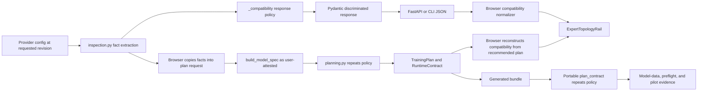
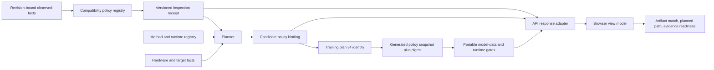

# Model Compatibility Evidence Concept Code and Architecture Review

> **Documentation status:** Archived and superseded review evidence
>
> **Applies to:** Point-in-time compatibility-contract review recorded below
>
> **Last reviewed:** 2026-08-06
>
> **Next scheduled review:** 2027-08-06, or when provenance or a named successor changes
>
> **Historical warning:** This review is preserved without rewriting its body.
> Statements below that say a condition is current, open, or complete describe
> the reviewed snapshot, not the present repository. Use the
> [historical-review index](../README.md) to find current successors.

**Last Updated:** 2026-07-29
**Scope:** Provider identity and topology inspection, compatibility policy,
planning, portable bundle validation, API and CLI contracts, generated OpenAPI,
browser ingestion, workbench presentation, evidence records, tests, and maintained
documentation.
**Review basis:** Current `fix/fail-closed-compatibility-contract` working tree
after the status-discriminated response repair. The untracked
`TempDoc-ForUserReview/` package was excluded as an authority.

## Executive Summary

The immediate repair is sound. A conditional response can no longer omit its
runtime, method, placement, adapter scope, pilot requirement, or reason. FastAPI
and the browser reject contradictory status combinations. The browser tests now
assert the complete support sentence, so a word hidden in the reason cannot make
a missing placement clause pass.

The larger concept still has one central weakness. Aptus does not have one
durable model-compatibility decision. It has several implementations of the same
policy:

1. provider identity normalization in `inspection.py`;
2. a compatibility response assembled in `inspection.py`;
3. executable admission logic in `planning.py`;
4. a separate portable copy in `plan_contract.py`;
5. a browser reconstruction in `modelInspection.ts`.

Those copies agree today for the first Qwen3 MoE row. A second model, runtime,
adapter profile, or evidence level will make drift much more likely. The current
shape also mixes three different questions: whether an artifact matches a model
policy, whether a candidate is feasible on selected hardware, and whether runtime
evidence has passed. Users see all three through similar words such as
`conditional`, `unsupported`, and `supports`.

The best target is a versioned compatibility-policy registry in the domain
layer. It should emit a content-bound inspection decision, a list of fully bound
execution paths, structured reason codes, and required validation gates. The
planner should intersect those paths with hardware and target facts. Generated
bundles should receive a policy snapshot and digest. The browser should present
the server decision and current validation state without recreating policy.

This is an architecture review. It does not authorize implementation of the
findings below.

## Current Data and Control Flow



The provider side is bounded and revision-aware. `inspect_huggingface_model()`
limits response size, requires an immutable resolved revision, records
provider-declared provenance, and keeps permission and parameter count outside
provider inference (`src/aptus/inspection.py:424-484`,
`src/aptus/inspection.py:534-593`).

The inspection response is now a closed discriminated union. Conditional data
requires every execution claim. Recognized and unsupported data prohibit those
claims (`src/aptus/api_contracts.py:251-293`). The generated TypeScript surface
preserves the three variants (`web/src/generated/openapi.ts:522-546`,
`web/src/generated/openapi.ts:841-842`).

Planning does not consume that compatibility decision. The browser copies the
inspection facts into a new plan request (`web/src/lib/modelInspection.ts:125-151`,
`web/src/api.ts:162-209`). The backend then labels the complete model record
`USER_ATTESTED` with source `cli-or-api` (`src/aptus/profiling.py:959-1031`). The
planner independently repeats the Qwen3 MoE identity, layout, topology, runtime,
method, distribution, backend, and adapter-target checks
(`src/aptus/planning.py:437-486`).

The portable bundle must remain independent from the installed Aptus package.
It currently achieves that by carrying another handwritten policy table and
another Qwen3 MoE predicate (`src/aptus/plan_contract.py:10-102`,
`src/aptus/plan_contract.py:1790-1812`). The model-data gate then compares the
loaded pinned configuration with the plan (`src/aptus/plan_contract.py:590-661`).
This last gate is a strong safety boundary.

When the inspection result is absent after restoration, the browser reconstructs
a compatibility result from the recommended v3 candidate. That code repeats the
exact Qwen3 identity, layout, runtime, compiler, estimator, evidence, export, and
target-module policy (`web/src/lib/modelInspection.ts:194-252`).

## Critical Issues

### CRIT-1: Compatibility policy has several independent authorities

The same executable row appears in at least four production policy
implementations:

- inspection decides exact identity and emits the MLX-LM QLoRA path
  (`src/aptus/inspection.py:313-415`);
- planning independently decides whether the path is executable
  (`src/aptus/planning.py:437-501`);
- the portable contract keeps separate identity, target, layout, runtime, and
  status rules (`src/aptus/plan_contract.py:19-102`,
  `src/aptus/plan_contract.py:1762-1812`);
- the browser independently rebuilds the same decision
  (`web/src/lib/modelInspection.ts:194-252`).

`catalog.py` supplies some shared constants, but the portable contract cannot
import it and the browser does not consume it. The current agreement depends on
manual synchronization. A later policy can become inspectable but not
executable, executable but not portable, or executable while the browser labels
it unsupported.

**Required correction:** Create one canonical, typed `ModelCompatibilityPolicy`
registry in a domain module. A policy entry should own identity predicates,
required fact provenance, allowed execution paths, adapter profile, runtime
contract identities, required validation gates, evidence IDs, and policy
version. Generate a portable policy snapshot from that registry. Bind its digest
into the plan and bundle. Keep portable validation self-contained, but stop
maintaining it as an independent source of policy truth.

### CRIT-2: The plan loses the inspection decision and its provenance chain

Inspection returns fact-level provenance and an immutable resolved revision
(`src/aptus/inspection.py:557-593`). The browser applies the values, then submits
ordinary model fields (`web/src/lib/modelInspection.ts:125-151`,
`web/src/api.ts:168-209`). `build_model_spec()` marks every model fact as
user-attested from `cli-or-api` (`src/aptus/profiling.py:977-1031`). `TrainingPlan`
has no inspection receipt or policy binding (`src/aptus/domain.py:640-653`). Plan
identity also omits model provenance (`src/aptus/plan_contract.py:669-702`,
`src/aptus/plan_contract.py:1126-1151`).

The tests demonstrate the practical result. `make_qwen3_moe_plan()` constructs a
viable conditional Qwen3 plan entirely from supplied fields, without an
inspection receipt (`tests/aptus/helpers.py:76-124`). Runtime model-data
validation still checks the actual pinned config, so this does not bypass final
execution gates. It does mean the plan cannot prove whether its early
compatibility claim came from provider evidence or caller assertion.

This conflicts with the documented statement that facts retain provenance
(`docs/architecture/system.md:33-44`). It also prevents Aptus from expressing a
useful distinction between `provider-verified policy match` and
`user-declared path pending model-data verification`.

**Required correction:** Make inspection produce a versioned receipt. Bind the
model ID, resolved revision, normalized facts digest, provenance summary, policy
ID, policy version, result, and decision ID. Planning should consume that receipt
or explicitly record that the facts remain user-attested. Policies can then
require provider provenance before a path receives a provider-verified label.
The model-data gate remains mandatory in both cases.

### CRIT-3: The repaired conditional contract is structurally closed but its vocabulary is open

The conditional Pydantic variant requires nonempty strings, but it does not bind
runtime, method, distribution, or adapter scope to known domain values
(`src/aptus/api_contracts.py:251-259`). The browser makes the same nonempty-string
decision (`web/src/lib/modelCompatibility.ts:60-71`). As a result, this payload
currently validates as conditional:

```json
{
  "status": "conditional",
  "family": "future_family",
  "supported_runtime": "not-a-runtime",
  "supported_methods": ["not-a-method"],
  "distribution": "not-a-placement",
  "evidence_requirement": "pilot-required",
  "adapter_scope": "not-a-profile",
  "reason": "All fields are nonempty."
}
```

The current producer emits known constants, so ordinary requests are coherent.
A future producer change or version-skewed response can still pass the response
and browser guards while carrying no executable meaning.

**Required correction:** Use domain enums or stable IDs for runtime, method,
distribution, backend, and adapter profile. Validate each path against the
canonical method and runtime registries. Add negative contract tests for unknown
values, not only missing and contradictory values.

## Important Improvements

### IMP-1: Separate policy match, candidate feasibility, and evidence readiness

Three distinct state machines currently share similar vocabulary:

- inspection compatibility uses `conditional`, `recognized`, and `unsupported`
  (`src/aptus/api_contracts.py:251-281`);
- candidate planning uses `feasible`, `conditional`, `infeasible`, and
  `unsupported` (`src/aptus/domain.py:75-79`);
- validation uses `unsupported` plus an ordered evidence ladder through
  `measured-run-pass` (`src/aptus/domain.py:95-107`).

The UI converts an inspection-level conditional match into the sentence
`mlx-lm supports ...` before planning, runtime discovery, model-data validation,
or a pilot (`web/src/components/ExpertTopologyRail.tsx:117-124`). The sentence
includes the pilot boundary, but the leading verb still overstates the state.

**Recommended change:** Use different nouns and values for each layer:

- `ModelPolicyDecision`: `path-matched`, `family-recognized`, `blocked`, or
  `unknown`;
- `CandidateAssessment`: `feasible`, `conditional-fit`, `infeasible`, or
  `unsupported`;
- `ValidationState`: keep the existing evidence ladder.

The UI should say `Eligible for the reviewed pilot path` at inspection time.
Only the validation surface should say which gate has actually passed.

### IMP-2: Model execution paths as records, not parallel fields

The current response can name one runtime and one distribution, a list of
methods, and one adapter scope (`src/aptus/api_contracts.py:251-259`). This shape
cannot safely describe two paths when each method needs a different runtime,
distribution, compiler, export, or adapter profile.

**Recommended change:** Return `paths: list[CompatibilityPath]`. Every path
should bind:

- `path_id`;
- training runtime and compute backend;
- method and distribution;
- adapter profile ID and exact target-module policy;
- compiler, estimator, and export identities;
- required validation levels;
- evidence IDs.

The planner can intersect these path records with target and hardware facts. A
new runtime becomes a new path, not another branch spread through five files.

### IMP-3: Version and identify compatibility decisions

The response has no compatibility schema version, policy ID, policy version,
decision ID, subject digest, or evaluation timestamp
(`src/aptus/api_contracts.py:251-307`). `aptus.api.v1` identifies the broader API,
but it cannot tell a client that policy meaning changed. Plan identity binds a
formula version and runtime contract identity, not a model-policy version
(`src/aptus/plan_contract.py:1126-1151`).

**Recommended change:** Add `aptus.model-compatibility.v2`, a stable policy ID,
semantic policy version, normalized subject digest, and content-derived decision
ID. Add the selected policy and path binding to candidate identity. A policy
meaning change must either change the policy version or require a plan-schema
bump.

### IMP-4: Remove policy reconstruction from the browser

`moeCompatibilityFromPlan()` recreates server policy from a recommended
candidate (`web/src/lib/modelInspection.ts:194-252`). `App.tsx` gives an existing
inspection decision precedence over that reconstruction
(`web/src/App.tsx:463-465`). Neither source necessarily describes the candidate
the user is currently inspecting.

The fail-closed browser normalizer is useful defense in depth. The policy
reconstruction is not. It turns TypeScript into another authorization authority.

**Recommended change:** Persist the server-produced `policy_binding` in the plan
and each candidate. Render the binding for the selected candidate. Keep one
runtime decoder at the API boundary. Components should receive a normalized view
model and should not re-evaluate compatibility policy.

### IMP-5: Connect compatibility claims to evidence records

Method candidates carry paper and memory-estimate evidence from the method
registry (`src/aptus/methods/registry.py:112-145`,
`src/aptus/planning.py:803-841`). The evidence registry does not contain a Qwen3
MoE policy record, MLX-LM implementation record, or the measured blocked
admission attempt (`src/aptus/evidence.py:6-112`). Those artifacts exist under
`docs/operations/evidence/2026-07-28-qwen3-moe-admission/`, but the compatibility
decision and plan do not reference them.

**Recommended change:** Give each policy and execution path evidence IDs. Record
both positive and limiting evidence. The current 30B admission record should say
that dependency validation passed and live memory blocked model loading. It must
not appear as a successful model-data or pilot record. A future passing pilot
should be revision, policy, runtime-stack, hardware, and dataset scoped.

### IMP-6: Restore the intended dependency direction

`inspection.py` now imports the HTTP response model so a core producer can
validate itself (`src/aptus/inspection.py:10-21`,
`src/aptus/inspection.py:418-421`). This seals the CLI producer, but it makes the
inspection core depend on the API representation. The code map assigns response
ownership to `api_contracts.py` and provider inspection ownership to
`inspection.py` (`docs/architecture/code-map.md:40-50`).

**Recommended change:** Put the typed decision and invariants in a domain-level
compatibility module. Let inspection return that domain object. Let the CLI
serialize it and let `api_contracts.py` adapt it into the Pydantic response.
This keeps the invariant without reversing the core dependency direction.

## Minor Suggestions

### MIN-1: Preserve invalid-contract as a presentation state

The browser converts malformed evidence into a genuine `unsupported` domain
record (`web/src/lib/modelCompatibility.ts:14-27`,
`web/src/lib/modelCompatibility.ts:83-92`). Blocking is correct. The label is not
precise. A model outside policy and a server contract violation need different
operator actions.

Return a view-layer result such as `{ kind: "invalid-contract", message }` while
still disabling every execution claim. This gives diagnostics and version-skew
messages without weakening fail-closed behavior.

### MIN-2: Keep generated types strict at the application boundary

`ModelCompatibility` uses the generated union, which is good
(`web/src/types.ts:79`). The containing manual inspection interface widens status
with `| string` and permits arbitrary fact keys (`web/src/types.ts:81-109`).
`api.inspectModel()` then casts an unknown object back to that interface
(`web/src/api.ts:531-540`).

Define the decoder input from the generated OpenAPI type. Return a separate,
explicit normalized view type. Avoid widening known status values unless the
normalizer exposes an `unknown-version` result.

### MIN-3: Use reason codes for behavior and prose for explanation

The current policy exports only a free-text reason. Tests must pin complete UI
sentences to prevent evidence loss (`web/src/components/ExpertTopologyRail.test.tsx:65-131`).
Keep those presentation tests, but add stable reason codes and structured failed
predicates. Code should never branch on prose.

## Strongest Recommended Target Architecture

The core distinction should be explicit:

```text
provider observation
    -> model policy decision
        -> candidate assessment
            -> validation evidence state
                -> execution outcome
```

One possible decision contract is:

```json
{
  "schema_version": "aptus.model-compatibility.v2",
  "decision_id": "compat_...",
  "result": "path-matched",
  "policy": {
    "policy_id": "model.qwen3-moe.mlx-qlora",
    "policy_version": "1.0.0"
  },
  "subject": {
    "model_id": "provider/model",
    "revision": "immutable-commit",
    "facts_sha256": "...",
    "provenance_requirement": "provider-declared",
    "provenance_requirement_met": true
  },
  "paths": [
    {
      "path_id": "mlx-lm.qlora.single.attention-v1",
      "training_runtime": "mlx-lm",
      "compute_backend": "mps",
      "method": "qlora",
      "distribution": "single",
      "adapter_profile_id": "attention-qkvo.v1",
      "compiler_id": "mlx-lm.qlora.v1",
      "estimator_id": "aptus-memory-mlx-v2",
      "export_kind": "mlx-lm-adapter",
      "required_validation_levels": [
        "model-data",
        "measured-preflight",
        "pilot"
      ],
      "evidence_ids": ["runtime.mlx-lm.qwen3-moe.v1"]
    }
  ],
  "reason_codes": ["exact-reviewed-artifact", "pilot-not-yet-proven"]
}
```

The model policy registry should live above HTTP and below inspection and
planning. The method registry remains the authority for method and runtime
compiler bindings. The compatibility evaluator references those bindings by
stable IDs. It should not duplicate them.



The workbench should present three separate statements:

1. **Artifact match:** exact policy and revision that matched.
2. **Planned path:** selected runtime, method, placement, adapter profile, and
   compiler binding.
3. **Evidence readiness:** current validation state and the next required gate.

This structure scales to dense models, additional MoE families, CUDA paths, and
multiple adapters without weakening current claims.

## Tests and Migration Risks

### Required test strategy

1. Build a table-driven policy matrix from canonical policy fixtures. Run the
   same exact and near-match cases against inspection, planning, and the portable
   snapshot evaluator.
2. Add mutation tests that change one identity, topology, layout, runtime,
   method, distribution, adapter, compiler, estimator, or evidence field at a
   time. Every mutation should identify the failed predicate and block the path.
3. Reject unknown runtime, method, distribution, backend, adapter-profile, and
   policy IDs at both Python and browser boundaries.
4. Test receipt tampering, revision mismatch, facts-digest mismatch, provenance
   downgrade, stale policy version, and missing policy snapshot.
5. Test browser version skew separately from genuine model rejection. Both block
   execution claims, but they must show different recovery guidance.
6. Assert the selected candidate's policy binding in the UI. Do not reconstruct
   it from the recommended candidate.
7. Generate the portable policy snapshot twice and assert byte identity. Assert
   host and portable policy digests match.
8. Keep the real Qwen3 MoE runtime ladder. The existing low-memory refusal stays
   a blocked admission record until a real model-data and pilot run passes.

### Migration risks

- Adding a policy binding changes candidate and plan identity. Use
  `aptus.training-plan.v4`. Existing v3 plans should return `replan_required`.
  Do not infer a current policy binding for an old plan.
- Generated bundles must remain independent from the Aptus package. Ship a
  canonical JSON policy snapshot and generic portable evaluator. Do not import
  the host registry at runtime.
- CLI users currently can construct model facts directly. Preserve that workflow
  with an explicit user-attested decision state, or add an inspection-receipt
  input. Do not silently relabel supplied facts as provider-declared.
- Policy updates can invalidate saved plans even when the model values are
  unchanged. The policy version and digest must make that invalidation explicit.
- A runtime decoder generated from OpenAPI can reject an older backend. Surface
  that as a contract-version problem, not as evidence that the model itself is
  unsupported.

## What Is Already Correct and Should Be Preserved

- Provider reads are bounded, errors fail closed, and successful inspection
  requires an immutable resolved revision (`src/aptus/inspection.py:91-111`,
  `src/aptus/inspection.py:424-484`).
- Provider facts, inferred family, user training permission, and total parameter
  attestation remain conceptually separate (`src/aptus/inspection.py:534-593`).
- Exact matching avoids family-prefix admission and validates complete topology
  and quantization layout (`src/aptus/inspection.py:262-350`).
- The repaired API response uses closed status variants with required fields
  (`src/aptus/api_contracts.py:251-293`).
- Generated OpenAPI exposes a real TypeScript union, and browser ingestion has a
  fail-closed runtime guard (`web/src/generated/openapi.ts:522-546`,
  `web/src/generated/openapi.ts:841-842`,
  `web/src/lib/modelCompatibility.ts:52-92`).
- Exact UI-copy tests now require runtime, method, placement, and reason in the
  correct branch. Malformed conditional evidence cannot render a support claim
  (`web/src/components/ExpertTopologyRail.test.tsx:65-131`).
- The planner keeps unsupported combinations visible and accepts only the narrow
  single-device MLX-LM QLoRA row for Qwen3 MoE
  (`src/aptus/planning.py:437-501`).
- Total resident parameters remain distinct from active routed parameters
  (`src/aptus/domain.py:447-472`).
- Candidate runtime contracts bind compiler, estimator, evidence requirement,
  backend, runtime, and export identity (`src/aptus/domain.py:139-172`).
- Portable model-data validation compares the loaded pinned configuration with
  the plan before runtime evidence can advance
  (`src/aptus/plan_contract.py:590-661`).
- The validation ladder distinguishes contract, dependency, model-data,
  preflight, pilot, execution approval, and measured completion
  (`docs/reference/validation-states.md:30-47`).
- Generated bundles remain self-contained. Any policy consolidation must retain
  that property.

## Phased Implementation Order

### Phase 1: Close the remaining contract vocabulary

Bind runtime, method, distribution, backend, and adapter profile to known IDs.
Add unknown-value tests. Change inspection copy from `supports` to
`eligible for the reviewed pilot path`. Preserve the current discriminated union
until the replacement contract is ready.

### Phase 2: Establish one domain policy registry

Add domain decision and path types. Move compatibility invariants out of
`api_contracts.py`. Make inspection and planning call the same evaluator. Keep
the method registry authoritative for runtime compiler bindings.

### Phase 3: Bind provenance and versioning

Add the inspection receipt, policy ID and version, facts digest, reason codes,
and evidence IDs. Carry the selected policy path into candidate identity. Bump
the plan schema and fail old plans closed with `replan_required`.

### Phase 4: Generate the portable contract

Emit a canonical policy snapshot and digest into each bundle. Replace the
handwritten portable Qwen policy with a generic snapshot evaluator. Add host and
portable parity tests before removing old branches.

### Phase 5: Simplify the browser and clarify the product

Remove `moeCompatibilityFromPlan()`. Decode one server-produced decision. Render
artifact match, selected path, and evidence readiness separately. Preserve the
current topology and resident-memory explanation.

### Phase 6: Prove extensibility with a second policy

Add one genuinely reviewed second model or runtime path through registry data,
not special-case branches. Require the complete test and runtime evidence ladder.
This is the best proof that the architecture can grow safely.

## Next Steps

1. Review and approve the target contract and status vocabulary.
2. Decide whether direct CLI facts remain allowed as explicitly user-attested or
   whether every executable sparse path requires an inspection receipt.
3. Implement Phase 1 as a narrow follow-up.
4. Design the plan-v4 and portable policy-snapshot migration before changing
   persisted identities.
5. Keep the current 30B MoE claim blocked until target-host evidence passes.

Please review the findings and approve which changes to implement before I
proceed with any fixes.
