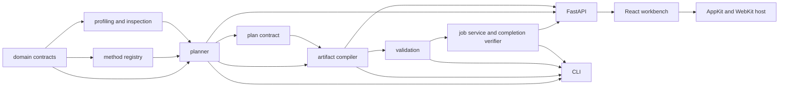

# Code Map

> **Status:** Active | **Audience:** Contributors | **Authority:** Explanatory | **Applies to:** Aptus 0.2 | **Owner:** Architecture | **Last reviewed:** 2026-07-22 | **Review by:** 2027-01-22

Aptus has four execution surfaces: the native macOS host, the Python
application, the React workbench, and the self-contained Python programs
emitted into each bundle.
This map identifies the source of truth for each responsibility and the tests
that protect it.

## Top-level structure

| Path | Responsibility |
|---|---|
| `src/aptus/` | Planner, compiler, validator, job service, API, and CLI |
| `src/aptus/methods/` | Typed method lifecycle and compiler-readiness registry |
| `web/src/` | React workbench source |
| `src/aptus/_web/` | Built workbench assets packaged in the Python wheel |
| `desktop/macos/` | AppKit/WebKit host, native bridge, packaging, and Mac tests |
| `pyproject.toml`, `uv.lock` | Python package contract and locked product-test environment |
| `tests/aptus/` | Product, contract, generator, API, and execution tests |
| `tests/tools/` | Legacy-audit tool tests |
| `tools/aptus_audit/` | Reproducible forensic-audit tooling for the preserved legacy evidence |
| `docs/` | Current guidance, contracts, operations, research, and historical evidence |
| `examples/` | Synthetic datasets for planning and contract examples |

## Python module responsibilities

| Module | Owns | Must not silently decide |
|---|---|---|
| [`domain.py`](../../src/aptus/domain.py) | Typed facts, candidates, plans, validation states, run states, and serialization | Model permission, quality, or unsupported defaults |
| [`methods/contracts.py`](../../src/aptus/methods/contracts.py) | Method descriptor and lifecycle shape | Executability by registry presence alone |
| [`methods/registry.py`](../../src/aptus/methods/registry.py) | Eleven runtime descriptors and the exact selectable set | Planner feasibility or target-host success |
| [`evidence.py`](../../src/aptus/evidence.py) | Versioned evidence records referenced by candidates and methods | Runtime proof from a paper or documentation page |
| [`catalog.py`](../../src/aptus/catalog.py) | Direct package pins, supported model-family target modules, and stack versions | Provider compatibility without inspection |
| [`profiling.py`](../../src/aptus/profiling.py) | Dataset parsing/profiling, canonical rows, pilot pressure rows, model-fact construction, and hardware discovery | Tokenizer measurement when only the character estimate ran |
| [`inspection.py`](../../src/aptus/inspection.py) | Bounded provider metadata inspection and family aliasing | License or training permission |
| [`planning.py`](../../src/aptus/planning.py) | Candidate enumeration, feasibility, memory use, Pareto marking, and deterministic ranking | Universal optimality or measured fit |
| [`plan_contract.py`](../../src/aptus/plan_contract.py) | Canonical candidate/plan identities and bundle-manifest verification | Runtime artifact success |
| [`generation.py`](../../src/aptus/generation.py) | Artifact compiler plus generated trainer, runner, preflight, and validator sources | In-place bundle mutation or child-owned success promotion |
| [`attestation.py`](../../src/aptus/attestation.py) | Strict trainable-parameter census validation shared by host code | Method preparation itself |
| [`validation.py`](../../src/aptus/validation.py) | Host-side validation ladder and report persistence | Cancellable runtime execution through the direct API path |
| [`runtime_lease.py`](../../src/aptus/runtime_lease.py) | Portable per-user execution lease and process-group control | Reservation against unrelated accelerator programs |
| [`execution.py`](../../src/aptus/execution.py) | Persisted jobs, admission, cancellation, recovery, and parent completion verification | Model quality |
| [`api.py`](../../src/aptus/api.py) | Strict FastAPI request models, endpoints, persistence context, and packaged SPA serving | A secure multi-user boundary |
| [`cli.py`](../../src/aptus/cli.py) | Command parsing and orchestration over the same core contracts | Alternate planning or validation semantics |
| [`desktop.py`](../../src/aptus/desktop.py) | Ephemeral loopback binding and private desktop-service readiness | Native UI state or a public network service |

`src/aptus/__main__.py` delegates `python -m aptus` to the CLI. The installed
`aptus` command is declared in `pyproject.toml` and uses the same entrypoint.

## Dependency direction

The diagram shows conceptual dependency direction. It is not a complete Python
import graph. In particular, validation reuses selected job-side hardware
binding helpers so host and managed checks agree.

## The generated-runtime boundary

The compiler emits four executable programs from constants in
[`generation.py`](../../src/aptus/generation.py):

- `TRAIN_SCRIPT` becomes `train.py`;
- `RUN_SCRIPT` becomes `run.py`;
- `PREFLIGHT_SCRIPT` becomes `preflight.py`;
- `VALIDATE_SCRIPT` becomes `validate.py`.

It also copies the current `plan_contract.py` and `runtime_lease.py` into the
bundle. The bundle must work without importing the Aptus application package at
runtime. This boundary is why a change to a shared contract often needs both
host-side tests and generated-module tests.

`generation.py` also owns trainer and Accelerate configuration, bundle reports,
manifest production, atomic publication, and deterministic ZIP creation. Do
not edit a generated bundle and copy the result back by hand. Change the source
generator, compile a fresh fixture, and review the output diff.

## Workbench map

| Path | Responsibility |
|---|---|
| [`App.tsx`](../../web/src/App.tsx) | Workflow state, restoration, active-job guards, polling, and stage transitions |
| [`api.ts`](../../web/src/api.ts) | Request construction, response normalization, and API errors |
| [`types.ts`](../../web/src/types.ts) | Browser-side API and view models |
| [`stages/`](../../web/src/stages) | Facts, Compare, Compile, Validate, and Run screens |
| [`components/`](../../web/src/components) | Shared candidate, evidence, artifact, job, and navigation components |
| [`lib/`](../../web/src/lib) | Hardware, model-inspection, and plan view helpers |
| [`demo.ts`](../../web/src/demo.ts) | Clearly labeled non-executed example state |
| [`styles.css`](../../web/src/styles.css) | Visual tokens, layout, responsive behavior, focus, and motion policy |
| [`desktopBridge.ts`](../../web/src/desktopBridge.ts) | Complete feature detection for native pickers and Finder actions |

The Vite build writes to `src/aptus/_web` and clears its prior contents. Those
assets are package data in the wheel. A source-only web change is incomplete
until the packaged build is regenerated and the installed-wheel asset smoke
test passes.

## Test map

The Python tests broadly mirror production modules:

- `test_domain.py`, `test_plan_contract.py`, and `test_methods.py` protect typed
  and identity contracts;
- `test_profiling.py`, `test_inspection.py`, and `test_planning.py` protect fact
  intake and candidate decisions;
- `test_generation.py`, `test_validation.py`, and `test_attestation.py` protect
  generated artifacts and evidence;
- `test_execution.py` and `test_runtime_lease.py` protect job, lease,
  cancellation, recovery, and completion behavior;
- `test_api.py` and `test_cli.py` protect public interfaces;
- `test_documentation.py` checks current Markdown links, fences, and stale
  contract identifiers.

Web tests sit beside the component, stage, or helper they protect. They use
Vitest and Testing Library.

## Find the right change point

| Change | Begin with | Then inspect |
|---|---|---|
| Add or change a fact | `domain.py` | API, CLI, plan identity, web types, compiler profiles, docs |
| Add a method identity | `methods/registry.py` and `evidence.py` | Method tests and research documentation |
| Make a method selectable | `domain.py`, registry, planner, catalog | Generator, validation, export, API/UI, negative tests, target-host pilots |
| Change memory arithmetic | `planning.py` | Formula version, identity, methodology, release gates, calibration tests |
| Change bundle contents | `generation.py` | Required files, manifest validation, archive determinism, installed-wheel smoke |
| Change runtime evidence | Generated templates and `validation.py` | `attestation.py`, `execution.py`, state docs, failure tests |
| Change job behavior | `execution.py` and `runtime_lease.py` | API/CLI/UI, recovery, cancellation, multi-process tests |
| Change an endpoint | `api.py` | `web/src/api.ts`, `types.ts`, API tests, API reference |
| Change the workbench | `web/src/` | accessibility, responsive behavior, packaged build, UI contract |
| Change the Mac host | `desktop/macos/` and `desktop.py` | bridge contract, cookie boundary, packaged sidecar, native tests |

## Related documentation

- [System architecture](system.md)
- [Data and identity flow](data-and-identity-flow.md)
- [Artifact compiler](artifact-compiler.md)
- [Execution orchestrator](execution-orchestrator.md)
- [Contributor guide](../contributing/index.md)
