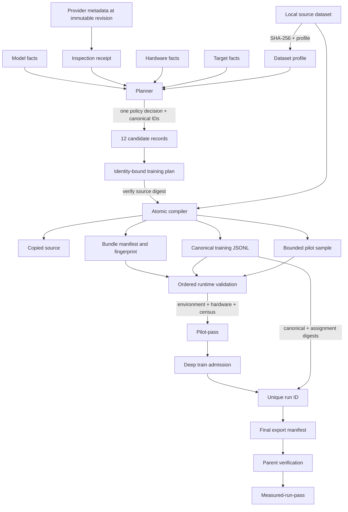

# Data and Identity Flow

> **Status:** Active | **Audience:** Contributors, operators, and security reviewers | **Authority:** Explanatory | **Applies to:** Aptus 0.2 | **Owner:** Architecture | **Last reviewed:** 2026-08-04 | **Review by:** 2027-01-27

Aptus binds decisions and runtime evidence to exact content. It uses separate
identities for projects, revisions, source data, candidates, plans, bundles,
environments, hardware, splits, trainable parameters, jobs, runs, and exports. No single digest stands
in for all of them.

## End-to-end flow

## Fact provenance

Each important fact carries one of five provenance kinds:

- `measured`: observed from a local file, device, or runtime check;
- `provider-declared`: returned by a bounded repository endpoint;
- `user-attested`: entered and affirmed by the operator;
- `inferred`: produced by a versioned Aptus rule;
- `unknown`: no defensible value is available.

Provider-declared model fields do not become permission facts. Manual hardware
values do not become target-host measurements. An inferred model family does
not replace the raw provider model type or architecture evidence.

For a sparse model, the `aptus.training-plan.v6` model payload binds exact
provider type, architecture, checkpoint precision, expert count, experts per
token, expert width, sparse cadence, dense-only layer indices, and optional
shared-expert width. It also binds backend-derived active parameters and
sparse-layer count.
The user-attested total parameter count remains a separate resident-weight fact.
Changing any of these values changes candidate and plan identity.

A provider inspection resolves one immutable revision and can emit an
`aptus.model-inspection-receipt.v1`. Its `subject_facts_sha256` binds only the
facts evaluated by `aptus.model-compatibility.v2`. Its separate
`observed_facts_sha256` binds every provider-declared or inferred model fact
actually carried into planning. Parameter count and training permission remain
user-attested and are excluded from the receipt. A plan without a receipt says
`user-attested`; a plan with a valid receipt says `provider-inspection`.
Receipt entries use only those two inspection kinds. They cover every non-null
compatibility subject field and include at least one provider-declared subject
observation. This prevents unrelated or wholly user-attested facts from
establishing provider-inspection provenance.

## Source dataset identity

Profiling resolves the source path and records its SHA-256, size, format,
schemas, counts, sequence statistics, sample indices, warnings, and provenance.
The sample limit bounds length statistics. It does not define the compiled
training set.

At compilation, Aptus copies the source to `data/dataset.<suffix>` and hashes
the copy. A mismatch with the profiled digest aborts compilation. It then
validates every supported source row and writes deterministic, key-sorted JSONL
to `data/training.jsonl`. It separately writes a bounded pilot pressure set to
`data/pilot-sample.jsonl`.

The portable plan refers to the copied source path inside the bundle while
retaining the original content digest. This makes the bundle relocatable
without weakening data identity.

## Candidate and plan identities

A candidate ID begins with `cand_` and hashes a canonical semantic payload. The
payload includes:

- normalized model, dataset, hardware, and target facts;
- method, distribution, precision, quantization, and device placement;
- exact batch arithmetic;
- adapter and target-module settings;
- exact sparse topology, total resident parameters, and derived routed activity
  when the model is MoE;
- status and feasibility;
- the shared policy decision ID and, only for an exact path match, the
  `aptus.model-policy-binding.v1` object;
- memory components, upper bounds, formula version, host RAM, disk, checkpoint,
  export, and reserve terms.

A plan ID begins with `plan_`. It binds the plan and formula schema versions,
normalized facts, the semantic policy decision and source,
`model_policy_snapshot_sha256`, the optional inspection receipt with its nested
explanatory decision reason excluded, the sorted canonical evidence records,
the ordered candidate IDs, and the recommended candidate ID. IDs are content
identities, not editable labels. Changing a bound semantic fact without
recomputing identity makes validation fail. Known evidence records must also
match their code-owned canonical contents.

All candidates link to the same decision, including candidates with no
registered execution path. Only the candidate whose method, placement, target
modules, and runtime contract match the emitted path has a non-null policy
binding. Installed-host loading, compilation, recovery, admission, pilot
authorization, worker launch, and the completion verification and promotion
transaction compare a v6 decision and snapshot digest with the current
registry. Load, compile, recovery, and submission workflows surface a coherent
mismatch as `replan_required`; pilot authorization reports non-current, and
pending completion evidence is not promoted. Host static validation records the
same currency mismatch as an invalid `POLICY_SNAPSHOT_DIGEST` finding. V4, v3,
v2, and schema-less plans receive the corresponding fail-closed result and
remain unchanged on disk.

The HTTP planning boundary preserves this chain on both success and failure. A
successful v5 response and a typed 422 `no_feasible_plan` response each carry
the server-produced v2 decision, its source, the nullable inspection receipt,
candidate decision links, and an explicit null or object binding per candidate.
The maintained browser client verifies exact record shapes and versions, then
cross-checks decision, path, receipt, binding, and candidate execution identity.
It also requires the response's model subject to match the submitted model ID
and immutable revision, then verifies the expected source and receipt ID. Every
no-feasible candidate must be rejected. Every candidate must supply method,
distribution, status, feasibility, rejection reasons, target modules, runtime
contract, decision link, and binding. It does not derive policy from topology or
candidate fields. A provider path-matched receipt proves its provider-declared
requirement with provider-declared provenance; inferred-only observations cannot
satisfy that match. A successful response's recommendation must structurally
equal the complete listed candidate record with the same candidate ID.

The workbench projects that verified state into three independent records:
artifact match, selected candidate path, and evidence readiness. The second
uses only the selected candidate's explicit nullable binding. Exact policy-path
equality requires a non-null binding; unbound or rejected candidates get no
invented policy-validation ladder or impossible action. The third accepts a
validation state and admission value only when the report binds the current plan
ID, selected candidate ID, and immutable model revision. Stage-completion and
validation or run action gates use the same exact three-field predicate.

Evidence progress and launch admission are different axes. Evidence can remain
incomplete or become complete while the optional admission tuple has no non-null
member, meaning not checked. When present, `authorization_status` is exactly
`current`, `deferred`, or `blocked`. Current pairs with
`authorization_current: true` and no error; deferred or blocked pairs with false
and a non-empty `authorization_error`. Partial or contradictory tuples fail at ingress. The
browser branches on the typed status rather than diagnostic prose and preserves
the last report when a generic training request fails. A non-current status does
not itself mean stale policy or replanning. An explicit `replan_required`
lifecycle response owns that result. The MoE rail remains a separate topology
and memory view in which all checkpoint weights stay resident even when only a
subset of experts is active per token.

The historical coherence pass uses the persisted decision and one internally
consistent adapter-target set, not the current mutable family catalog. The
ordinary current-plan pass still requires exact current catalog targets. An
unsupported adapter for an unregistered family carries no targets and can
truthfully record zero checkpoint retention because it has no trainable adapter
parameters.

## Project and revision identities

A named project uses schema `aptus.project.v1` and keeps an ordered list of
immutable revision IDs. Each `aptus.project-revision.v1` record contains its
project and parent identities, ordinal, reason, available fact and plan
snapshots, selected candidate, bundle reference, durable validation summary,
and job IDs. `content_sha256` binds the revision payload.

Project reads and writes share an in-process lock and an operating-system file
lock. Revision publication uses a durable transaction receipt, then writes the
content-hashed revision, advances the manifest, updates the selected-project
pointer, and removes the receipt. Each write uses atomic replacement and a
directory sync. After interruption, Aptus can finish a receipt-bound revision
or adopt a unique orphan chain that extends the indexed parent and ordinal. It
rejects and quarantines corrupt, ambiguous, or previously rejected orphans.
They never become history merely because a revision-shaped file exists.

The current-project pointer records selection intent separately from project
recency. Recovery may advance the selected project's revision, but it cannot
replace a later explicit selection of another project with an older interrupted
transaction. This ordering prevents crash repair from changing which project
the operator chose after that transaction began.

Recovery does not restore a snapshot in place. It validates any referenced plan
or bundle, then appends a new revision whose reason identifies the source. Both
ordinary persistence and recovery store `training_authorization.current` as
false. Current capacity and deep authorization remain train-submission facts.

At first startup after this change, Aptus imports legacy plans, the current
bundle pointer, and matching jobs into named project history. The import receipt
is versioned and idempotent. Source records remain in place.

## Bundle integrity

`bundle-manifest.json` uses schema `aptus.bundle.v3`. It binds the plan digest,
plan ID, selected candidate ID, formula version, compiler version, direct stack
versions, entrypoints, validation levels, and every compiler-managed file by
relative path, size, and SHA-256. It also names
`policy/model-policy-snapshot.v1.json` and binds its digest. That digest must
equal `model_policy_snapshot_sha256` in the v5 plan and the snapshot file's
manifested SHA-256.

The host registry serializes `aptus.model-policy-snapshot.v1` canonically and
deterministically. The bundle carries those exact bytes plus a generic
evaluator that has no installed-Aptus dependency. In a package-free context,
portable validation uses that frozen snapshot to establish canonical-byte,
plan, manifest, file-digest, and decision-parity integrity. It has no installed
host or current registry and therefore cannot determine host policy currency.
Installed Aptus separately compares the bound digest and decision with the
current registry during host-managed submission, pilot authorization, worker
launch, and the completion verification and promotion transaction. Host and
portable evaluation must produce the same decision for the same compatibility
subject.

The bundle fingerprint is the SHA-256 of that manifest when it exists. Bundle
validation rejects symlink roots, symlink entries, unsafe paths, missing files,
changed files, duplicate entries, and unexpected unmanifested inputs.

A compiled project revision stores that manifest fingerprint as a first-class
artifact identity. If a ZIP exists, the revision also stores its SHA-256 and
exact byte size. Recovery verifies the saved plan snapshot, selected candidate,
bundle path, manifest fingerprint, and ZIP identity before it appends a new
revision. Validation, job submission, and bootstrap require the current
revision's exact plan, candidate, bundle path, and manifest fingerprint. A
matching path or matching plan ID alone is insufficient.

These mutable paths are intentionally outside the compiler file list:

- `.validation-report.lock`;
- `model-data-evidence.json`;
- `validation-report.json`;
- `preflight-metrics.json`;
- `pilot-output/`;
- `runs/`.

Their evidence is bound by runtime schemas, IDs, paths, sizes, and hashes rather
than by pretending runtime outputs are immutable compiler inputs.

## Environment and hardware bindings

Dependency validation records Python, platform, exact direct constraint
versions, and the installed runtime distribution closure. `requirements.txt`
is an exact direct constraint set, not a complete transitive lock.

Measured validation records runtime-specific device and memory evidence. CUDA
binds participating device identities. MLX binds live unified-memory admission.
Train admission compares current capacity with pilot-bound evidence. A
historical pass cannot reserve current resources.

## Trainable-parameter identity

The trainable census binds the selected method to positive, finite tensor and
parameter counts plus a digest over sorted names, shapes, and dtypes. The digest
does not expose parameter values.

Full training requires every model tensor to be trainable. LoRA-based methods
require one complete A/B pair for every inspected target-module instance and no
other trainable tensor. Optimizer parameter identities must exactly equal the
validated trainable identities. Both CUDA pilot phases must report the same
census. MLX binds one A/B pair to every planned target in every layer and proves
a positive adapter delta in its uninterrupted run.

## Split identity and mutation detection

The CUDA full trainer computes one deterministic split over the complete canonical
JSONL. It records:

- the canonical JSONL digest;
- the split strategy;
- an assignment digest;
- total, train, evaluation, group, and split-unit counts;
- target and realized evaluation sizes and row error.

Rows sharing a declared `split_group` remain atomic. Ungrouped rows are
independent split units. The grouped solver reaches the exact target when the
group sizes and available ungrouped rows permit it, then chooses the closest
feasible size otherwise.

The trainer hashes the canonical file during split passes, checks file identity
before and after each lazy read, and requires distributed ranks to agree on the
canonical and assignment digests and counts. A mutation aborts the run.

MLX compilation instead creates disjoint train and validation files, pads only
within each split, and binds source and compiled counts in
`aptus.mlx-split.v1`. The current MLX contract does not claim group-aware subset
selection or an exact requested evaluation fraction.

## Job, run, and export identities

Managed actions receive persisted `job_` identities. Full training also
receives a unique `run_` identity and a new `bundle/runs/run_*/` directory. A
child cannot reuse an existing run path.

The child writes metrics and final-export evidence. The parent verifies
runtime-specific process success, plan/candidate/run bindings, finite metrics,
positive updates, trainable scope, data evidence, and immutable safetensors.
CUDA also binds distribution ranks and its split contract. MLX also binds fresh
adapter generation and `resume_supported: false`. Only then does the parent
promote the report to `measured-run-pass`.

Persisted jobs carry `aptus.job-record.v1`. A record without a schema version
migrates to that shape, with authorization cleared. Unsupported, malformed, or
symlinked records are quarantined instead of silently accepted.

This attests the exact run and structural file tree. It does not establish
quality, safety, inference parity, or deployment fitness.

## Data-copy and trust boundary

The source copy, canonical JSONL, pilot sample, MLX split files, ZIP, model
cache, validation reports, job logs, CUDA checkpoints, MLX weight snapshots,
metrics, tokenizer files, and exports can all contain sensitive material.
Backup and synchronization software can create more
copies. Bundle integrity detects changes. It does not encrypt or govern access
to those files.

Receipt, decision, candidate, plan, and bundle hashes are tamper-evident content
bindings. They are not authenticated signatures and do not prove who created an
artifact. Aptus therefore trusts its local process and client boundary while
still rejecting mismatched content.

Keep the API on loopback. Treat anyone who can call it as able to use the Aptus
process user's file and compute permissions.

## Related documentation

- [Facts and provenance](../methodology/facts-and-provenance.md)
- [Plan schema](../reference/plan-schema.md)
- [Bundle manifest](../reference/bundle-manifest.md)
- [Validation states](../reference/validation-states.md)
- [Security boundaries](security-boundaries.md)
