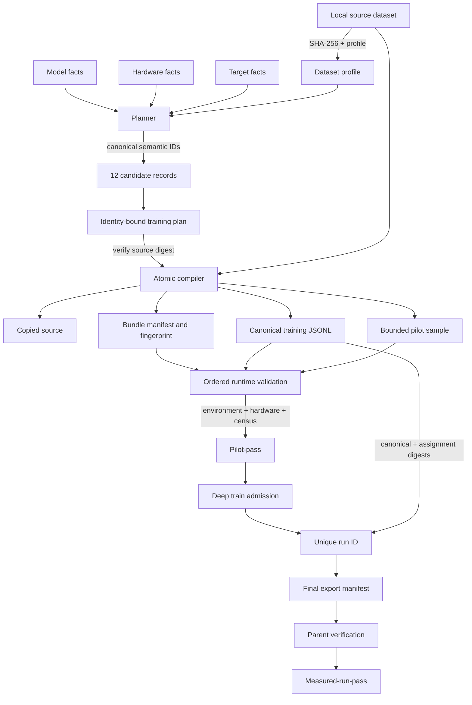

# Data and Identity Flow

> **Status:** Active | **Audience:** Contributors, operators, and security reviewers | **Authority:** Explanatory | **Applies to:** Aptus 0.2 | **Owner:** Architecture | **Last reviewed:** 2026-07-22 | **Review by:** 2027-01-22

Aptus binds decisions and runtime evidence to exact content. It uses separate
identities for source data, candidates, plans, bundles, environments, hardware,
splits, trainable parameters, jobs, runs, and exports. No single digest stands
in for all of them.

## End-to-end flow

## Fact provenance

Each important fact carries one of five provenance kinds:

- `measured`: observed from a local file, device, or runtime check;
- `provider-declared`: returned by a bounded repository endpoint;
- `user-attested`: entered and affirmed by the operator;
- `inferred`: produced by a versioned Aptus rule;
- `unknown`: no defensible value is available.

Provider-declared model fields do not become permission facts. Manual hardware
values do not become target-host measurements. An inferred model family does
not replace the raw provider model type or architecture evidence.

## Source dataset identity

Profiling resolves the source path and records its SHA-256, size, format,
schemas, counts, sequence statistics, sample indices, warnings, and provenance.
The sample limit bounds length statistics. It does not define the compiled
training set.

At compilation, Aptus copies the source to `data/dataset.<suffix>` and hashes
the copy. A mismatch with the profiled digest aborts compilation. It then
validates every supported source row and writes deterministic, key-sorted JSONL
to `data/training.jsonl`. It separately writes a bounded pilot pressure set to
`data/pilot-sample.jsonl`.

The portable plan refers to the copied source path inside the bundle while
retaining the original content digest. This makes the bundle relocatable
without weakening data identity.

## Candidate and plan identities

A candidate ID begins with `cand_` and hashes a canonical semantic payload. The
payload includes:

- normalized model, dataset, hardware, and target facts;
- method, distribution, precision, quantization, and device placement;
- exact batch arithmetic;
- adapter and target-module settings;
- status and feasibility;
- memory components, upper bounds, formula version, host RAM, disk, checkpoint,
  export, and reserve terms.

A plan ID begins with `plan_`. It binds the plan and formula schema versions,
normalized facts, the ordered candidate IDs, and the recommended candidate ID.
IDs are content identities, not editable labels. Changing a bound semantic fact
without recomputing identity makes validation fail.

## Bundle integrity

`bundle-manifest.json` uses schema `aptus.bundle.v2`. It binds the plan digest,
plan ID, selected candidate ID, formula version, compiler version, direct stack
versions, entrypoints, validation levels, and every compiler-managed file by
relative path, size, and SHA-256.

The bundle fingerprint is the SHA-256 of that manifest when it exists. Bundle
validation rejects symlink roots, symlink entries, unsafe paths, missing files,
changed files, duplicate entries, and unexpected unmanifested inputs.

These mutable paths are intentionally outside the compiler file list:

- `.validation-report.lock`;
- `validation-report.json`;
- `preflight-metrics.json`;
- `pilot-output/`;
- `runs/`.

Their evidence is bound by runtime schemas, IDs, paths, sizes, and hashes rather
than by pretending runtime outputs are immutable compiler inputs.

## Environment and hardware bindings

Dependency validation records Python, platform, exact direct constraint
versions, and the installed runtime distribution closure. `requirements.txt`
is an exact direct constraint set, not a complete transitive lock.

Measured validation records runtime-specific device and memory evidence. CUDA
binds participating device identities. MLX binds live unified-memory admission.
Train admission compares current capacity with pilot-bound evidence. A
historical pass cannot reserve current resources.

## Trainable-parameter identity

The trainable census binds the selected method to positive, finite tensor and
parameter counts plus a digest over sorted names, shapes, and dtypes. The digest
does not expose parameter values.

Full training requires every model tensor to be trainable. LoRA-based methods
require one complete A/B pair for every inspected target-module instance and no
other trainable tensor. Optimizer parameter identities must exactly equal the
validated trainable identities. Both CUDA pilot phases must report the same
census. MLX binds one A/B pair to every planned target in every layer and proves
a positive adapter delta in its uninterrupted run.

## Split identity and mutation detection

The CUDA full trainer computes one deterministic split over the complete canonical
JSONL. It records:

- the canonical JSONL digest;
- the split strategy;
- an assignment digest;
- total, train, evaluation, group, and split-unit counts;
- target and realized evaluation sizes and row error.

Rows sharing a declared `split_group` remain atomic. Ungrouped rows are
independent split units. The grouped solver reaches the exact target when the
group sizes and available ungrouped rows permit it, then chooses the closest
feasible size otherwise.

The trainer hashes the canonical file during split passes, checks file identity
before and after each lazy read, and requires distributed ranks to agree on the
canonical and assignment digests and counts. A mutation aborts the run.

MLX compilation instead creates disjoint train and validation files, pads only
within each split, and binds source and compiled counts in
`aptus.mlx-split.v1`. The current MLX contract does not claim group-aware subset
selection or an exact requested evaluation fraction.

## Job, run, and export identities

Managed actions receive persisted `job_` identities. Full training also
receives a unique `run_` identity and a new `bundle/runs/run_*/` directory. A
child cannot reuse an existing run path.

The child writes metrics and final-export evidence. The parent verifies
runtime-specific process success, plan/candidate/run bindings, finite metrics,
positive updates, trainable scope, data evidence, and immutable safetensors.
CUDA also binds distribution ranks and its split contract. MLX also binds fresh
adapter generation and `resume_supported: false`. Only then does the parent
promote the report to `measured-run-pass`.

This attests the exact run and structural file tree. It does not establish
quality, safety, inference parity, or deployment fitness.

## Data-copy and trust boundary

The source copy, canonical JSONL, pilot sample, MLX split files, ZIP, model
cache, validation reports, job logs, CUDA checkpoints, MLX weight snapshots,
metrics, tokenizer files, and exports can all contain sensitive material.
Backup and synchronization software can create more
copies. Bundle integrity detects changes. It does not encrypt or govern access
to those files.

Keep the API on loopback. Treat anyone who can call it as able to use the Aptus
process user's file and compute permissions.

## Related documentation

- [Facts and provenance](../methodology/facts-and-provenance.md)
- [Plan schema](../reference/plan-schema.md)
- [Bundle manifest](../reference/bundle-manifest.md)
- [Validation states](../reference/validation-states.md)
- [Security boundaries](security-boundaries.md)
