# System Architecture

> **Status:** Active | **Authority:** Normative architecture overview | **Applies to:** Aptus 0.2 | **Audience:** Contributors, operators, and integrators | **Last reviewed:** 2026-07-22 | **Review by:** 2027-01-22 or when a system boundary changes

Aptus separates facts, planning, compilation, validation, execution, and
completion evidence. Each boundary has a distinct contract.

```mermaid
flowchart LR
  A["Explicit facts"] --> B["Profiler and planner"]
  B --> C["Identity-bound plan"]
  C --> D["Atomic artifact compiler"]
  D --> E["Portable bundle"]
  E --> F["Dependency"]
  F --> G["Model-data"]
  G --> H["Measured preflight"]
  H --> I["Two-phase pilot"]
  I --> J["Deep train admission"]
  J --> K["Unique full run"]
  K --> L["Parent verification"]
  L --> M["Measured-run-pass"]
```

## 1. Fact intake

The API, CLI, and workbench produce the same model, dataset, hardware, and
target contracts. Facts retain provenance. Dataset profiling reads local data.
Optional model inspection retrieves bounded provider metadata. Optional hardware
inspection measures the local server host.

The user remains responsible for model and data rights. Provider fields do not
become permission facts automatically.

## 2. Planning

The planner reads only the registry's four selectable `gated-executable`
methods, enumerates the versioned 12-row placement matrix, applies support rules,
calculates transparent point and upper memory estimates, and ranks viable
`feasible` and `conditional` candidates, with feasible candidates first. Plan
and candidate IDs derive from canonical semantic payloads. Changing a bound fact
changes identity. Experimental, research-only, and documentation-only methods
cannot enter enumeration.

Planning is analytic. It does not import the selected training stack or allocate
CUDA memory.

## 3. Compilation

The compiler writes to a temporary sibling directory, validates the result, and
publishes it atomically. It refuses a non-empty destination. The bundle contains
the full canonical training rows, a bounded pilot set, the portable plan,
evidence, direct pins, generated programs, configuration, reports, and a hash
manifest. Archive creation is deterministic and no-clobber.

## 4. Validation

Validation is monotonic in required evidence:

1. `contract`
2. `static`
3. `dependency`
4. `model-data`
5. `measured-preflight`
6. `pilot`

Each runtime level binds its output to the bundle, plan, candidate, dataset,
model revision, environment, hardware, and prior artifacts as applicable. A
higher state does not turn estimates into quality measurements.

Model-data prepares the selected method and enforces its trainable scope.
Measured preflight persists a synthetic-path census. Both real-model pilot
phases must carry identical census records before the pilot can pass.

## 5. Execution

The local `JobService` persists jobs and logs under a selected state root. It
allows one Aptus GPU action at a time for the same user across state roots by
using a host-global lease. Portable `validate.py`, `preflight.py`, and `run.py`
use the same lease contract. Unrelated CUDA programs do not participate.

Dependency, model-data, preflight, pilot, and train are separate ordered job
submissions. The service blocks forward skips until the preceding report state
passes. An operator may rerun an earlier passed action. Each higher validation
action cumulatively rechecks its lower levels inside that job as
defense-in-depth. Runtime validation through the API must use the job endpoint
so it remains cancellable.

## 6. Full-run admission and completion

Train submission holds the global lease and record locks while it deeply
revalidates pilot and capacity evidence. It then assigns a unique job and run ID.
The training child writes pending evidence to that run directory.

The full trainer computes a deterministic group-aware split over the complete
canonical JSONL. It binds canonical and assignment digests, detects mutation,
requires distributed agreement, and records requested and realized evaluation
sizes. Its grouped subset solver reaches the target when the atomic group sizes
make that possible. It also recomputes the method-scope census before optimizer
construction, binds one LoRA A/B pair to each inspected target instance, and
requires exact optimizer membership.

After child success, the parent enters `verifying`. It checks metrics, split and
census evidence, bindings, rank records, final-export structure, paths, sizes,
and hashes. It persists the attestation and promotes the report to
`measured-run-pass` in an idempotent transaction. Child exit alone cannot
declare completion.

For direct portable execution on POSIX, `run.py` performs the same parent role,
holds the shared lease through completion promotion, and recovers complete
pending evidence before starting another run. Direct portable child execution
is fail-closed on Windows in v0.2. Use the managed service there.

## Interfaces

- CLI: local scripting and operator use.
- FastAPI: same-origin local workbench and programmatic control.
- React workbench: five-stage planning and execution flow.
- Portable bundle: host-independent artifacts with local runtime requirements.

Cloud provider adapters, evaluation targets, exporter plugins, and MCP adapters
are future seams. They are not part of the v0.2 execution graph.

## Related documentation

- [Code map](code-map.md)
- [Data and identity flow](data-and-identity-flow.md)
- [Artifact compiler](artifact-compiler.md)
- [Execution orchestrator](execution-orchestrator.md)
- [Security boundaries](security-boundaries.md)
