# System Architecture

> **Status:** Active | **Authority:** Normative architecture overview | **Applies to:** Aptus 0.2 | **Audience:** Contributors, operators, and integrators | **Last reviewed:** 2026-07-29 | **Review by:** 2027-01-27 or when a system boundary changes

Aptus separates facts, planning, compilation, validation, execution, and
completion evidence. Each boundary has a distinct contract.

```mermaid
flowchart LR
  A["Explicit facts"] --> B["Profiler and planner"]
  Q["Optional inspection receipt"] --> B
  B --> C["Identity-bound runtime contract"]
  C --> D["Compiler dispatch"]
  D --> E["Portable bundle"]
  E --> F["Dependency"]
  F --> G["Model-data"]
  G --> H["Runtime-specific measured preflight"]
  H --> I{"Training runtime"}
  I -->|"CUDA"| J["Two-phase pilot"]
  I -->|"MLX-LM"| O["Uninterrupted adapter pilot"]
  J --> K["Deep train admission"]
  O --> K
  K --> L["Unique full run"]
  L --> M["Parent verification"]
  M --> N["Measured-run-pass"]
```

The local product adds an append-only control-plane history around this flow.
Named projects record immutable revisions after planning, compilation,
validation, and job submission. A recovery operation verifies referenced local
artifacts and creates a new revision. It never mutates an old revision or
restores training authorization.

## 1. Fact intake

The API, CLI, and workbench produce the same model, dataset, hardware, and
target contracts. Facts retain provenance. Dataset profiling reads local data.
Optional model inspection retrieves bounded provider metadata. Optional hardware
inspection measures the local server host.

Inspection keeps raw `model_type` and architecture identities. For the exact
Qwen3 MoE row, it also returns checkpoint precision, routed-expert topology,
and an `aptus.model-inspection-receipt.v1` containing a structured
`aptus.model-compatibility.v2` decision. Normalized inspection facts and typed
planning facts call the same host-side model policy registry. Its internal
decision distinguishes a matched path, a recognized dense family, a blocked
sparse near-match, and an unknown family. The unchanged public v1 response maps
those states to `conditional`, `recognized`, and `unsupported`.
Sparse model-type and architecture markers remain blocked when topology is
missing. They cannot inherit a dense-family recognition through normalization.

A matched path binds known runtime, compute-backend, method, distribution,
adapter-profile, and target-module values. The method registry constructs its
runtime contract and remains authoritative for compiler, estimator, export, and
evidence-requirement identities. The API accepts a `conditional` claim only when
that complete tuple is registered for the named model family. Total parameters
and training permission remain user attestations. The backend derives active
parameters and sparse-layer count only after it has the complete model contract.

Apple platform inspection is a separate contract. It reports operating system,
chip, CPU, unified memory, current memory and swap pressure, Metal guidance, and
an optional Metal GPU core count. It reports runtime capabilities without a chip
allowlist. Training-runtime inventory probes exact Python executables. LM Studio
and oMLX discovery remains inference-only.

The user remains responsible for model and data rights. Provider fields do not
become permission facts automatically.

## 2. Planning

The planner reads only the registry's four selectable `gated-executable`
methods, enumerates the versioned 12-row placement matrix, applies support rules,
calculates transparent point and upper memory estimates, and ranks viable
`feasible` and `conditional` candidates, with feasible candidates first. Plan
and candidate IDs derive from canonical semantic payloads. Changing a bound fact
changes identity. Experimental, research-only, and documentation-only methods
cannot enter enumeration.

Each candidate carries an `aptus.runtime-contract.v1` record. The record binds
the compute backend, training runtime, compiler, estimator, evidence
requirement, and export kind. CUDA uses the Transformers and PEFT contract.
MLX-LM uses a separate unified-memory estimator and supports only
single-device LoRA and QLoRA. PyTorch MPS is a known runtime without a compiler.
For `mps` planning, device free VRAM remains unknown. The MLX estimator uses
current free host RAM as the live unified-memory headroom cap when available.

The planner evaluates the model policy once per plan and intersects every
candidate with the emitted paths. Policy matching does not decide hardware fit,
memory fit, ranking, or evidence readiness. `aptus.training-plan.v5` persists
that decision and its `provider-inspection` or `user-attested` source. Every
candidate carries the decision ID. Only the candidate that exactly matches an
emitted path carries an `aptus.model-policy-binding.v1` object.

The receipt carries two different digests. `subject_facts_sha256` binds only
compatibility inputs. `observed_facts_sha256` binds every provider-declared or
inferred planning fact carried from inspection. Parameters and training
permission remain user-attested and outside the receipt. A present receipt must
revalidate completely. Invalid input never falls back to the user-attested
path. These content hashes are tamper-evident, not authenticated signatures.

The host policy registry keeps sparse planning narrower than general MLX-LM
support. It emits one path only for an
exact `qwen3_moe` and `Qwen3MoeForCausalLM` identity with four-bit group-64
defaults, one eight-bit group-64 router-gate override per layer, no shared
expert, QLoRA, `single`, and attention-only adapter targets. The v5 plan carries
the full topology and canonical quantization layout. Resident weights use total
parameters. Routed activity can inform compute and activation terms but never
reduces base-weight residency.

Planning is analytic. It does not import the selected training stack or
allocate accelerator memory.

Phase 4 places canonical `aptus.model-policy-snapshot.v1` bytes and a generic
evaluator in every generated bundle. `aptus.training-plan.v5` and
`aptus.bundle.v3` cross-bind the snapshot digest. Portable validation rejects a
missing, malformed, noncanonical, stale, or tampered snapshot and does not need
an installed Aptus package.

Phase 5 remains the browser-reconstruction removal. Phase 6 remains the second
reviewed policy. Neither is part of the portable policy contract.

## 3. Compilation

The runtime-bound compiler writes to a temporary sibling directory, validates
the result, and publishes it atomically. It refuses a non-empty destination.
The bundle contains the full canonical training rows, a bounded pilot set, the
portable plan, evidence, direct pins, generated programs, configuration,
reports, and a hash manifest. Archive creation is deterministic and no-clobber.

CUDA bundles contain the pinned Torch, Transformers, PEFT, Accelerate, and
method-specific paths. MLX-LM bundles contain pinned MLX and MLX-LM dependencies,
MLX data splits, an MLX adapter configuration, and runtime-neutral metrics.
MLX-LM QLoRA requires a model revision with explicit four-bit MLX quantization
metadata. It never imports bitsandbytes.
The exact Qwen3 MoE compiler profile also binds model identity, topology,
canonical quantization layout and digest, and attention-only adapter scope for
model-data and later runtime checks.

Runtime program source lives as package data under
`src/aptus/_bundle_programs/{cuda,mlx}/`. The compiler reads those bytes through
`importlib.resources`. Packaging tests require source-tree, wheel, and frozen
sidecar builds to preserve byte identity and the resulting manifest hashes.

## 4. Validation

Validation is monotonic in required evidence:

1. `contract`
2. `static`
3. `dependency`
4. `model-data`
5. `measured-preflight`
6. `pilot`

Each runtime level binds its output to the bundle, plan, candidate, dataset,
model revision, environment, hardware, and prior artifacts as applicable. A
higher state does not turn estimates into quality measurements.

CUDA model-data prepares the selected method and enforces its trainable scope.
Its measured preflight persists a synthetic-path census. Both real-model pilot
phases must carry identical census records before the pilot can pass.

MLX-LM model-data loads the pinned model revision and tokenizes every bound row.
Its measured preflight runs a bounded real adapter smoke, writes an MLX adapter,
and records completed optimizer work, exact target binding, positive adapter
delta, and a positive measured peak in `aptus.runtime-metrics.v1`. Its pilot
runs the exact model and data from the pinned base without interruption for at
least two optimizer updates. A fresh child then loads the emitted adapter and
generates one to four tokens. This proves adapter reload, not training resume.

## 5. Execution

The local `JobService` persists jobs and logs under a selected state root. It
allows one Aptus accelerator action at a time for the same user across state roots by
using a host-global lease. Portable `validate.py`, `preflight.py`, and `run.py`
use the same lease contract. Unrelated CUDA or Metal programs do not participate.

Dependency, model-data, preflight, pilot, and train are separate ordered job
submissions. The service blocks forward skips until the preceding report state
passes. An operator may rerun an earlier passed action. Each higher validation
action cumulatively rechecks its lower levels inside that job as
defense-in-depth. Runtime validation through the API must use the job endpoint
so it remains cancellable.

The job service resolves MLX-LM and PyTorch MPS against an exact external Python
interpreter. A configured path is probed before it is persisted and before it
can become the runtime for a job. The desktop sidecar is not assumed to contain
the user's training stack.

Job records use `aptus.job-record.v1`. Legacy records migrate to the current
shape with durable authorization cleared. Corrupt, symlinked, or unsupported
records move to private quarantine with a reason receipt. A bad record does not
prevent healthy jobs from loading.

## 6. Full-run admission and completion

Train submission holds the global lease and record locks while it deeply
revalidates pilot and capacity evidence. It then assigns a unique job and run ID.
The training child writes pending evidence to that run directory.

The full trainer computes a deterministic group-aware split over the complete
canonical JSONL. It binds canonical and assignment digests, detects mutation,
requires distributed agreement, and records requested and realized evaluation
sizes. Its grouped subset solver reaches the target when the atomic group sizes
make that possible. It also recomputes the method-scope census before optimizer
construction, binds one LoRA A/B pair to each inspected target instance, and
requires exact optimizer membership.

After child success, the parent enters `verifying`. It checks metrics, split and
census evidence, bindings, rank records, final-export structure, paths, sizes,
and hashes. It persists the attestation and promotes the report to
`measured-run-pass` in an idempotent transaction. Child exit alone cannot
declare completion.

For MLX-LM, train admission re-verifies the owned pilot and requires current
available unified memory above its measured peak plus reserve. A confirmed full
run starts again from the pinned base and derives its uninterrupted duration
from the compiled train rows, micro-batch, accumulation, and maximum epochs. The
parent verifies completed updates, finite train and validation losses, exact
target binding, positive memory and adapter delta, immutable artifacts,
fresh-process bounded generation, and `aptus.mlx-final-export.v1` before
promotion. MLX weight snapshots do not support resume.

For direct portable execution on POSIX, `run.py` performs the same parent role,
holds the shared lease through completion promotion, and recovers complete
pending evidence before starting another run. Direct portable child execution
is fail-closed on Windows in v0.2. Use the managed service there.

## Interfaces

- Aptus for Mac: AppKit lifecycle, SwiftUI Home, Workbench, Machine, and Models
  shell, private backend session, and one inline WebKit workbench. macOS 26 is
  the primary design and macOS 15 is the fallback.
- CLI: local scripting and operator use.
- FastAPI: same-origin local workbench and programmatic control.
- React workbench: five-stage planning and execution flow.
- OpenAPI: generated from explicit Pydantic response models and checked into
  `docs/reference/openapi.v1.json` under `aptus.api.v1`.
- Portable bundle: host-independent artifacts with local runtime requirements.

LM Studio and oMLX are loopback-only inference adapters. They do not enter the
training graph. Cloud provider adapters, evaluation targets, exporter plugins,
and MCP adapters are future seams.

## Related documentation

- [Code map](code-map.md)
- [Data and identity flow](data-and-identity-flow.md)
- [Artifact compiler](artifact-compiler.md)
- [Execution orchestrator](execution-orchestrator.md)
- [Security boundaries](security-boundaries.md)
- [macOS desktop host](macos-desktop.md)
